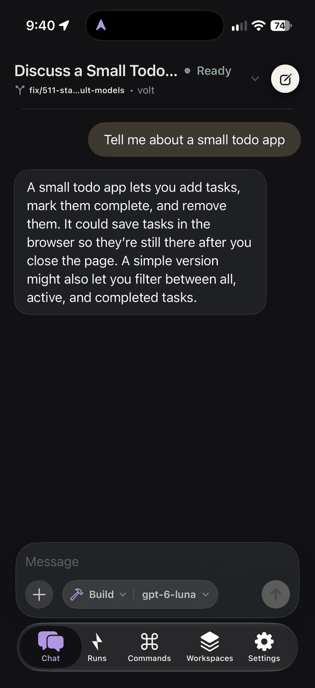
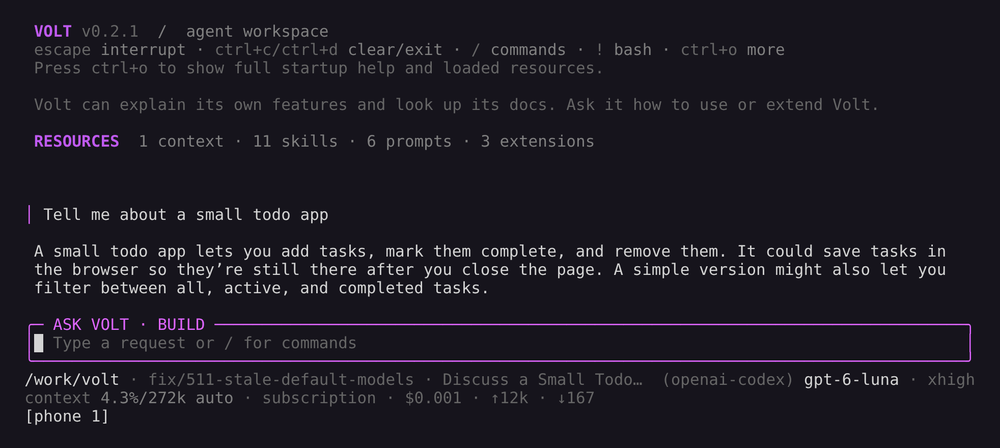

# Volt

**A coding agent from terminal to phone.**

Volt runs the agent and its tools on your computer. Use it in the terminal, then continue the same live conversation from the Volt iOS companion app when you step away. Bring your preferred model and keep your existing development environment.

[Website](https://volt-cli.dev/) · [Documentation](https://volt-cli.dev/docs/) · [Quickstart](https://volt-cli.dev/docs/quickstart/) · [Releases](https://github.com/volt-hq/Volt/releases) · [Roadmap](https://github.com/orgs/volt-hq/projects/1)

## What Volt includes

- **Terminal and phone sessions:** a background daemon connects the iOS app to registered workspaces over encrypted Iroh connections, with live transcripts and desktop/phone handoff.
- **Planning and code review:** native Plan mode for research and approved execution, plus snapshot-based reviews with independent verification.
- **Subagents and background jobs:** delegate bounded tasks to isolated agents and inspect or cancel session-owned work.
- **Code intelligence and tools:** file editing, shell execution, web search, LSP navigation/refactoring, and native MCP integration.
- **Persistent conversations:** resume sessions, branch from earlier turns, and compact long histories.
- **Customization and integration:** TypeScript extensions, skills, prompt templates, themes, installable packages, an SDK, and JSON/RPC modes.

## Install and start

Requires **Node.js 22.19 or newer**.

```bash
npm install -g --ignore-scripts @hansjm10/volt-coding-agent
cd /path/to/project
volt
```

Run `/login` to configure a supported subscription or API-key provider, then `/model` to choose a model. You can also configure provider credentials through environment variables. See [Providers](packages/coding-agent/docs/providers.md) for setup and provider-specific billing details.

`--ignore-scripts` disables dependency lifecycle scripts; Volt does not need them for normal npm installs. Keep optional dependencies enabled for phone transport.

Standalone executables are available on the [releases page](https://github.com/volt-hq/Volt/releases), but provide **local CLI/TUI only**, not the daemon or iOS connection. Use the npm installation for phone access. Intel macOS also lacks the native phone-transport binding. See [Standalone Binary Capabilities](packages/coding-agent/BINARY-CAPABILITIES.md).

<p align="center"></p>
<p align="center"><em>Volt 0.2.1 fixing a failing test in a sample project. See <a href="packages/coding-agent/docs/usage.md">Using Volt</a> for the interface and <a href="packages/coding-agent/docs/sessions.md">Sessions</a> for branching with <code>/tree</code>.</em></p>

## Continue from your iPhone

With the Volt companion app installed, start the host and register a project:

```bash
volt daemon start
volt remote workspace add /path/to/project --name my-project
volt remote pair --workspace my-project
```

Scan the one-time pairing QR in the app. You can also manage pairing, registered workspaces, and device revocation through `/remote` in the terminal.

- The app connects to the host runtime; it does not run the coding agent on the phone. Provider credentials and tool execution stay on your computer. Conversation content is transmitted to the app, and model requests go to your selected provider.
- Reconnect to the saved computer without scanning another QR. Supported terminal sessions attach to the running daemon so the phone can join the same conversation.
- Disconnecting or backgrounding the app does not cancel active work. Your computer must remain running and reachable; shutting down the host stops in-memory work.
- Direct and self-hosted connections are separate from Volt Pro's managed relay and completion-notification services. See the [privacy policy](https://volt-cli.dev/privacy) and [terms](https://volt-cli.dev/terms) for service details.

<p align="center">


</p>
<p align="center"><em>One conversation in the Volt iOS app and in the terminal (Volt 0.2.1). The prompt came from the phone and ran on the computer; <code>[phone 1]</code> in the terminal footer shows the attached phone.</em></p>

See the [phone quickstart](packages/coding-agent/docs/quickstart.md#continue-from-your-iphone), [daemon guide](packages/coding-agent/docs/daemon.md), and [remote security model](packages/coding-agent/docs/security.md#remote-access-over-iroh-preview) for requirements and troubleshooting.

## Safety

Volt runs with the permissions of the account that launches it. Project trust, tool allowlists, Plan mode, and remote grants control specific capabilities; they are **not an operating-system sandbox**. Local tools and trusted extensions can modify files, run processes, and access credentials available to that account.

Pair only devices you control. A phone driving a desktop-owned conversation uses that terminal session's local tool set. Use a container or VM when you need filesystem, process, or network isolation.

See [Security](packages/coding-agent/docs/security.md) and [Containerization](packages/coding-agent/docs/containerization.md). Report vulnerabilities privately using [SECURITY.md](SECURITY.md).

## Repository layout

This repository contains the open-source CLI, host daemon, shared libraries, website, and service code. The native iOS companion app is maintained separately; its source is not included here.

| Package | Description |
|---------|-------------|
| **[@hansjm10/volt-coding-agent](packages/coding-agent)** | Coding agent CLI, host daemon, SDK, and RPC integration |
| **[@hansjm10/volt-agent-core](packages/agent)** | Agent runtime with tool calling and state management |
| **[@hansjm10/volt-ai](packages/ai)** | Unified multi-provider LLM API |
| **[@hansjm10/volt-tui](packages/tui)** | Terminal UI library with differential rendering |

## Development

```bash
npm install -g npm@11.17.0 --ignore-scripts
npm install --ignore-scripts  # Install dependencies without lifecycle scripts
npm run check                 # Lint, format, and type check
./volt-test.sh                # Run Volt from source
```

Run only affected tests for local changes; docs-only updates need relevant link, example, and metadata checks. See [CONTRIBUTING.md](CONTRIBUTING.md) for focused test commands and [AGENTS.md](AGENTS.md) for project-specific rules.

On Windows, use `./volt-test.ps1` or `volt-test.bat`. See [Development](packages/coding-agent/docs/development.md) for setup details.

## Supply chain

We treat npm dependency changes as reviewed code changes.

- Direct external dependencies are pinned to exact versions. Internal workspace packages remain version-ranged.
- Development, CI, and release dependency resolution use exact npm 11.17.0 (`packageManager` plus erroring `devEngines`).
- `.npmrc` sets `save-exact=true` and `min-release-age=2`. Only Volt's self-packaged `@hansjm10/volt-iroh*` family bypasses that age quarantine; third-party releases do not.
- `package-lock.json` is the dependency ground truth. Pre-commit blocks accidental lockfile commits unless `VOLT_ALLOW_LOCKFILE_CHANGE=1` is set.
- `npm run check` verifies pinned direct deps, native TypeScript import compatibility, and the generated coding-agent shrinkwrap.
- The published CLI package includes `packages/coding-agent/npm-shrinkwrap.json`, generated from the root lockfile, to pin transitive deps for npm users. The exact `@hansjm10/volt-iroh` wrapper is required; its selected native platform binding remains optional. Installing with `--omit=optional` leaves phone transport unavailable.
- Local release installs, documented npm installs, and `volt update --self` use `--ignore-scripts` where supported.

## Origins and license

Volt is maintained and distributed by [Jordan Hans](https://github.com/hansjm10). It is derived from [Mario Zechner's Pi project](https://github.com/earendil-works/pi) under the MIT License. [Why I Forked Pi to Build Volt](https://volt-cli.dev/blog/why-i-forked-pi-to-build-volt/) explains the project's origins and terminal-to-phone direction.

Volt preserves the copyright and license notices for Pi and other incorporated open-source software. See [LICENSE](LICENSE) and [THIRD-PARTY-NOTICES.md](packages/coding-agent/THIRD-PARTY-NOTICES.md).

Volt's Git history restarts at the beginning of its architecture rewrite. The full earlier history, including the Pi history Volt was built from, remains available at the [`legacy/main`](https://github.com/volt-hq/Volt/tree/legacy/main) tag.
