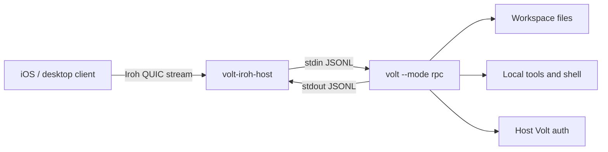

# Iroh Remote Access Design

## Status

Phase 2 is mostly complete in Volt core: RPC mode has a transport abstraction, Iroh streams have a structurally typed RPC adapter, remote command filtering is available, and the Iroh remote helpers now cover tickets, handshakes, host state, authorization, workspace selection, audit logging, and host/client engine orchestration. A first `volt remote host` path now delegates to the temporary native sidecar adapter and runs the source checkout's Volt runtime in-process over `runIrohRemoteRpcMode()`.

## Summary

Add optional remote access that exposes Volt's existing RPC protocol over [Iroh](https://www.iroh.computer/blog/v1). The current proof of concept keeps the native Iroh dependency out of Volt's default install path by using a sidecar example, while Volt core provides the typed transport, handshake, state, authorization, audit, and engine helpers needed for an integrated remote mode.

This turns Volt into a remotely reachable local coding agent without requiring users to open ports, configure reverse proxies, or move provider credentials to a mobile client. A future iOS app can use Iroh Swift support to connect to the user's host machine and render a native UI from RPC events.

## Background

Volt already has three relevant layers:

- `AgentSession` and the SDK for embedding Volt in Node.js applications.
- RPC mode (`volt --mode rpc`) for language-agnostic clients over LF-delimited JSONL.
- Extension UI requests in RPC mode, so remote clients can respond to confirmation, input, and selection prompts.

Iroh v1 provides key-based dialing, encrypted QUIC connections, NAT traversal, local-first discovery, relay fallback, and stable v1 wire compatibility. The v1 announcement also calls out official Rust, Node.js, Swift, Kotlin, and Python support, which matches a host-side native daemon plus future mobile clients.

## Goals

- Enable remote access to a local Volt session from another device without port forwarding.
- Keep model credentials, repository files, and tool execution on the host machine.
- Reuse Volt RPC as the application protocol instead of inventing a new agent protocol.
- Keep the native Iroh dependency optional while sharing remote protocol logic through core helpers.
- Define a security model before exposing shell/file tools remotely.

## Non-goals

- No TUI tunneling.
- No mobile app implementation in the first proof of concept.
- No built-in sandbox. Remote Volt has the same local-agent risks described in [Security](security.md).
- No required Iroh dependency in `@earendil-works/volt-coding-agent` until the optional native dependency strategy is chosen.
- No multi-user collaboration semantics in the first proof of concept.

## Current State

RPC mode defaults to process stdin/stdout:

```text
client process
  -> JSONL stdin
volt --mode rpc
  -> JSONL stdout
```

The RPC implementation now accepts a core transport abstraction, so stdin/stdout is one adapter. This is still enough for a sidecar bridge while leaving room for in-process, remote, or native transports.

## Proposed Architecture



The sidecar still owns native Iroh endpoint lifecycle for the proof of concept. Volt core owns shared remote protocol behavior: pairing tickets, handshake parsing, bounded handshake reads, host state management, client authorization, audit events, workspace selection, remote command filtering, and in-process RPC transport adapters. The sidecar can still spawn child RPC processes for fake-RPC and compatibility tests, but the integrated source-host path calls `runIrohRemoteRpcMode()` directly.

## Minimal Sidecar Proof of Concept

### Host command

```bash
volt-iroh-host serve --workspace volt=C:\Users\Jordan\source\repos\Volt
```

The host process:

1. Creates or loads a persistent Iroh endpoint key. The current sidecar stores this as `hostSecretKey` in `~/.volt/agent/remote/iroh-sidecar-host.json`.
2. Validates the selected workspace path and child RPC executable before printing a ticket.
3. Starts an Iroh endpoint. The current sidecar defaults to disabled relay for local tests; `--relay default` opts into Iroh's default relay/discovery preset.
4. Prints a pairing ticket as text.
5. Accepts client connections until stopped, or exits after the first disconnect when `--once` is set.
6. Validates the pairing secret.
7. Spawns the configured RPC child in the selected workspace; with `--use-volt`, this is `volt --mode rpc`.
8. Pipes Iroh stream bytes to child stdin and child stdout bytes back to the Iroh stream.
9. Writes sidecar diagnostics and prefixed child stderr to stderr.

### Client command

```bash
volt-iroh-client connect <pairing-ticket>
```

The client process:

1. Opens an Iroh endpoint.
2. Dials the host ticket.
3. Sends a JSON handshake containing the pairing secret, requested workspace name, client label, and protocol version.
4. Sends normal Volt RPC JSONL commands after the host accepts.
5. Renders RPC events in a minimal terminal UI or prints text deltas for the proof of concept.

### Pairing ticket shape

Use an opaque URL-safe payload so the format can change:

```text
volt+iroh://v1/<base64url-json>
```

Initial ticket payload fields:

```json
{
  "nodeId": "<iroh-node-id>",
  "workspace": "volt",
  "secret": "<one-time-secret>",
  "expiresAt": 1790000000000,
  "alpn": "volt-rpc/0"
}
```

The host must treat the ticket secret as one-time. After successful pairing, persist the client node ID and require that ID for later connections.

### Stream protocol

After the handshake succeeds, the stream carries the same LF-delimited JSONL described in [RPC mode](rpc.md). The current sidecar parses command envelopes only to enforce the remote command filter, track connection-level shutdown, and preserve response completion behavior. It should preserve strict LF framing and not use generic line readers that split on Unicode separators.

### Process model

Proof-of-concept defaults:

- One Iroh connection maps to one `volt --mode rpc` child process.
- One workspace per child process.
- Child exits when the Iroh connection closes.
- Host terminates the child on disconnect after a short grace period.
- Reconnect/resume is deferred; saved Volt sessions still work through normal session files.

## Security Model

Remote access to Volt is remote access to local files, shell commands, provider credentials, extensions, and project toolchains. The proof of concept must be explicit about that risk.

Required controls before any public release:

- Opt-in only. No listener starts unless the user runs the host command.
- Explicit pairing using a one-time secret.
- Persistent allowlist of paired client node IDs.
- Workspace allowlist. Remote clients choose from names, not arbitrary host paths.
- Client revocation command.
- Host-side audit log for connections, workspace selection, child process start/stop, and rejected attempts.
- No automatic `--approve`. Project trust should inherit existing Volt behavior unless the host user explicitly approves a workspace.
- Clear warning that `bash`, `write`, and `edit` allow remote modification of the host machine.

Recommended proof-of-concept safety default:

```bash
volt --mode rpc --tools read,grep,find,ls
```

Add an explicit host flag for write/shell access:

```bash
volt-iroh-host serve --workspace volt=. --allow-tools read,grep,find,ls,bash,edit,write
```

## Configuration

Suggested host config path:

```text
~/.volt/agent/remote/iroh-host.json
```

Suggested shape:

```json
{
  "hostName": "home-desktop",
  "workspaces": [
    { "name": "volt", "path": "C:\\Users\\Jordan\\source\\repos\\Volt" }
  ],
  "clients": [
    {
      "nodeId": "<client-node-id>",
      "label": "Jordan iPhone",
      "allowedWorkspaces": ["volt"],
      "allowedTools": ["read", "grep", "find", "ls"]
    }
  ]
}
```

The current sidecar state file also persists `hostSecretKey` and consumed pairing secret hashes. A productized command can split secret host state from user-editable configuration later.

## CLI UX

Initial external commands:

```bash
volt-iroh-host serve --workspace volt=/path/to/repo
volt-iroh-host pair --workspace volt
volt-iroh-host clients list
volt-iroh-host clients revoke <node-id>
volt-iroh-client connect <ticket>
```

Initial integrated Volt command:

```bash
volt remote host --workspace volt=/path/to/repo
```

Future integrated Volt commands:

```bash
volt remote pair --workspace volt
volt remote clients
volt remote revoke <node-id>
```

## Implementation Plan

### Phase 0: External sidecar, no Volt core changes

- Create a separate proof-of-concept package or repository for `volt-iroh-host` and `volt-iroh-client`.
- Use Iroh's stable Rust API first, or verify the Node.js binding API and use it if it is mature enough for the bridge.
- Spawn the installed `volt` binary with `--mode rpc`.
- Bridge bytes with backpressure handling.
- Support one workspace, one client, one session.
- Demonstrate prompt, streaming output, abort, model list, and read-only tools.

### Phase 1: Monorepo experiment

- Add an example under `packages/coding-agent/examples/remote/iroh-sidecar/` if the external proof of concept is successful.
- Keep native dependencies out of the default install path.
- Document setup, pairing, and security warnings.

### Phase 2: RPC transport and remote core extraction

Status: mostly complete.

Build on the core RPC transport abstraction so stdin/stdout remains one adapter:

```typescript
interface RpcTransport {
  write(value: object): Promise<void> | void;
  onLine(handler: (line: string) => void): () => void;
  close(): Promise<void> | void;
}
```

Then add adapters:

- stdio adapter for current `volt --mode rpc`.
- in-process adapter for SDK consumers.
- Iroh adapter if native dependency strategy is acceptable.

Current Volt core also includes typed Iroh remote helpers for ticket encoding/decoding, bounded handshakes, host state, authorization, audit logging, workspace management, pair/list/revoke operations, command filtering, and host/client engine orchestration. The sidecar example remains the native dependency integration point while those core APIs harden.

### Phase 3: Productized remote mode

- Add `volt remote ...` commands.
- Add reconnect/resume semantics.
- Add remote-safe response filtering where needed, such as hiding full host session paths from untrusted clients.
- Add mobile-oriented event batching and attachment transfer.
- Consider Iroh blobs for large images, logs, or session exports.

## Testing and Validation

Proof-of-concept validation:

- Pair a client and host on the same LAN.
- Pair a client and host across different networks using relay fallback.
- Send allowed remote RPC commands such as `get_state`, `prompt`, `abort`, `steer`, `follow_up`, and `extension_ui_response`.
- Verify assistant streaming events arrive in order.
- Verify extension UI requests can round-trip through the client.
- Verify child process exits when the Iroh stream closes.
- Verify unpaired clients are rejected.
- Verify a missing workspace path or Volt executable fails before printing a pairing ticket.
- Verify a client cannot request a workspace outside the host allowlist.

Automated tests for a monorepo version:

- Unit-test handshake parsing, ticket expiry, and client allowlist checks.
- Unit-test JSONL bridging with embedded `U+2028` and `U+2029` inside JSON strings.
- Integration-test the sidecar bridge against a fake child process before testing against Volt RPC.
- Integration-test against Volt's faux provider from the coding-agent test harness where possible.

## Risks

| Risk | Mitigation |
| --- | --- |
| Remote access exposes local shell and filesystem | Opt-in host command, read-only tool default, workspace allowlist, client revocation, clear warnings |
| Native dependency increases install complexity | Keep sidecar external or optional until the API and packaging story are proven |
| Mobile networks disconnect often | Add reconnect/resume after the initial proof of concept |
| RPC responses expose host paths | Document for PoC; add filtering or remote-safe state views before productization |
| Relay fallback may add latency or cost | Prefer direct connections, expose connection diagnostics, allow custom relay config later |
| Project extensions can run arbitrary code | Preserve project trust behavior and do not auto-approve remote workspaces |

## Open Questions

- Should the long-term host be a Rust binary, a Node.js package using Iroh Node bindings, or both?
- Should remote clients be limited to read-only tools by default even after pairing?
- How should mobile clients display and approve extension UI prompts?
- Should sessions created over remote access be tagged as remote in session metadata?
- What host path information should be hidden or normalized for remote clients?
- Should pairing be per-workspace or per-host with workspace-specific authorization?

## References

- [Iroh 1.0 announcement](https://www.iroh.computer/blog/v1)
- [RPC mode](rpc.md)
- [SDK](sdk.md)
- [Security](security.md)
