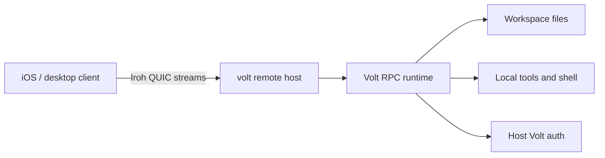

# Iroh Remote Access Design

## Status

The Iroh remote host is a supported preview for Node.js npm installs and source checkouts with optional `@number0/iroh` available for the platform. RPC mode has a transport abstraction, Iroh streams have a structurally typed RPC adapter, remote command filtering is available, and the Iroh remote helpers cover tickets, handshakes, host identity verification, host state, authorization, workspace selection, audit logging, redaction, reconnect/session selection, revocation, active stream registration, Live Activity routing, and host/client engine orchestration. `volt remote host` launches a product host entrypoint in the coding-agent package and runs Volt's runtime in-process over `runIrohRemoteRpcMode()`. Integrated hosts advertise `multi_streams.v1` and `conversation_streams.v1`, bind mobile streams during handshake to one workspace/session conversation, allow multiple sessions in the same workspace, treat stream close as client detach, keep active work running on the host, and reserve explicit cancellation for the selected stream's `abort` RPC command. The iOS app uses saved-host and workspace metadata to render pinned agent tabs across verified workspaces, opens New Agent and Resume Agent by targeted conversation stream, uses short-lived workspace discovery and management streams, and recovers selected conversations without another QR scan. The preview wire contract is documented in [Iroh Remote Protocol v1](iroh-remote-protocol.md). Unsupported areas remain explicit: Bun binary builds reject remote host startup, host process exit is not durable recovery, `volt remote status` is persisted-state-only, hidden-agent resource controls are conservative, and cross-network relay should be validated with `--relay default` in the target environment.

## Summary

Add optional remote access that exposes Volt's existing RPC protocol over [Iroh](https://www.iroh.computer/blog/v1). The native `@number0/iroh` dependency is optional in the coding-agent package, while Volt core provides the typed transport, handshake, state, authorization, audit, redaction, reconnect, revocation, and engine helpers needed for the integrated remote mode.

This turns Volt into a remotely reachable local coding agent without requiring users to open ports, configure reverse proxies, or move provider credentials to a mobile client. The iOS app uses Iroh Swift support to connect to the user's host machine and render a native UI from RPC events.

## Background

Volt already has three relevant layers:

- `AgentSession` and the SDK for embedding Volt in Node.js applications.
- RPC mode (`volt --mode rpc`) for language-agnostic clients over LF-delimited JSONL.
- Extension UI requests in RPC mode, so remote clients can respond to confirmation, input, and selection prompts.

Iroh v1 provides key-based dialing, encrypted QUIC connections, NAT traversal, local-first discovery, relay fallback, and stable v1 wire compatibility. The v1 announcement also calls out official Rust, Node.js, Swift, Kotlin, and Python support, which matches a host-side native daemon plus mobile clients.

## Goals

- Enable remote access to a local Volt session from another device without port forwarding.
- Keep model credentials, repository files, and tool execution on the host machine.
- Reuse Volt RPC as the application protocol instead of inventing a new agent protocol.
- Keep the native Iroh dependency optional while sharing remote protocol logic through core helpers.
- Define a security model before exposing shell/file tools remotely.

## Non-goals

- No TUI tunneling.
- No mobile app implementation in the host preview.
- No built-in sandbox. Remote Volt has the same local-agent risks described in [Security](security.md).
- No mandatory native dependency; `@number0/iroh` remains optional and remote host startup reports missing or unsupported native installs explicitly.
- No multi-user collaboration semantics in the host preview.

## Current State

RPC mode defaults to process stdin/stdout:

```text
client process
  -> JSONL stdin
volt --mode rpc
  -> JSONL stdout
```

The RPC implementation now accepts a core transport abstraction, so stdin/stdout is one adapter. `volt remote host` uses the in-process Iroh RPC adapter for the integrated host path.

## Architecture



The product host entrypoint owns native Iroh endpoint lifecycle through an isolated adapter module. Volt core owns shared remote protocol behavior: pairing tickets, handshake parsing, bounded handshake reads, host state management, client authorization, audit events, workspace selection, remote command filtering, and in-process RPC transport adapters. The integrated path calls `runIrohRemoteRpcMode()` directly.

## Minimal Remote Host

### Host command

```bash
volt remote host --workspace volt=<workspace-dir>
```

The host process:

1. Creates or loads a persistent Iroh endpoint key. The current host stores this as `hostSecretKey` in the selected host state file.
2. Validates the selected workspace path before creating or printing a ticket.
3. Starts an Iroh endpoint. The host defaults to Iroh's default relay/discovery preset so saved-host reconnects can survive host restarts; `--relay disabled` remains the explicit LAN-only opt-out.
4. Prints a startup pairing ticket QR code for the bare preview CLI when stderr is a TTY, plus the text ticket for copy/paste and scripting. Mobile-facing `--mobile` startup does not create or print a startup pairing ticket; adding a phone uses `volt remote pair` against the running host.
5. Accepts client connections until stopped, or exits after the first disconnect when `--once` is set.
6. Validates the pairing secret for new clients, or the paired client node ID for reconnecting clients.
7. Runs Volt in-process for the selected workspace.
8. Pipes Iroh stream bytes to the selected RPC runtime.
9. Writes host diagnostics to stderr.

### Example client command

```bash
npm run iroh:poc:client -- "<pairing-ticket>"
```

The client process:

1. Opens an Iroh endpoint.
2. Dials the host ticket.
3. Sends a JSON handshake containing the pairing secret, requested workspace name, client label, and protocol version.
4. Sends normal Volt RPC JSONL commands after the host accepts.
5. Renders RPC events in a minimal terminal UI or prints text deltas for the demo client.

### Pairing ticket shape

The supported preview ticket format and compatibility rules are specified in [Iroh Remote Protocol v1](iroh-remote-protocol.md). Use an opaque URL-safe payload so the format can change:

```text
volt+iroh://v1/<base64url-json>
```

Initial ticket payload fields:

```json
{
  "nodeId": "<iroh-node-id>",
  "irohTicket": "<iroh-endpoint-ticket>",
  "relayMode": "disabled",
  "workspace": "volt",
  "secret": "<one-time-secret>",
  "expiresAt": 1790000000000,
  "alpn": "volt-rpc/0"
}
```

The host must treat the ticket secret as one-time. After successful pairing, persist the client node ID and require that ID for later connections.

Saved-host reconnect records keep only non-secret discovery and identity data from a ticket: host `nodeId`, native endpoint ticket, relay mode, workspace, and timestamps owned by the client. Clients must drop `secret` and `expiresAt`, verify the endpoint ticket and handshake `hostNodeId` against the saved host node ID, and refresh discovery only after that identity check succeeds.

### Stream protocol

The supported preview stream handshake, strict LF framing, command allowlist, authoritative host/client identity rules, and outbound redaction guarantees are specified in [Iroh Remote Protocol v1](iroh-remote-protocol.md). After the handshake succeeds, the stream carries the same LF-delimited JSONL described in [RPC mode](rpc.md). The current host parses command envelopes only to enforce the remote command filter, track connection-level shutdown, and preserve response completion behavior. It should preserve strict LF framing and not use generic line readers that split on Unicode separators.

Failed authorization handshakes carry a stable machine-readable `outcome` next to the diagnostic `error` text. Clients should drive reconnect UX from `outcome` and use `error` for logs or secondary detail.

### Process model

Preview process model:

- `volt remote host` uses an in-process Volt runtime.
- Integrated runtime entries are keyed by authoritative client node ID, workspace name, and session ID.
- An authorized Iroh stream is a subscriber/control channel for that runtime; closing the stream detaches the subscriber and does not synthesize `abort`.
- Hosts advertise `multi_streams.v1` and `conversation_streams.v1` in stream-mode handshake success and `get_state.remoteHost.features`; clients that see both features can keep one paired Iroh connection open and add conversation streams for other registered workspace/session targets.
- Active detached integrated runtimes keep running on the host. Idle detached integrated runtimes are retained for 30 minutes by default, configurable with `--detached-runtime-ttl-ms`, then stopped by the retention policy.
- Reconnecting paired clients with the same authoritative client node ID, workspace, and session attach to the existing detached integrated runtime when it still exists. If no detached runtime exists, `target:last` resumes the last recorded session for that workspace when the session file still exists; if it is missing or invalid, the host creates and audits a replacement session.
- A second active stream for the same authoritative client node ID, workspace, and session on one live Iroh connection is rejected with `duplicate_conversation_connection`; the first conversation stream on a new same-client connection can replace a stale active stream and reattach to the retained integrated runtime. Streams for different sessions or registered workspaces can run concurrently and each stream uses its selected workspace for outbound `/workspace` mapping. Cross-client ownership of the same workspace/session fails with `conversation_in_use`.
- Workspace discovery streams authorize a workspace, allow only `list_sessions`, create no runtime, and do not update last-session state. Workspace management streams allow only same-workspace `unregister_workspace`, send the success response, then close affected streams and retained runtimes.
- Mobile conversation streams reject direct `new_session`, `switch_session_by_id`, and raw `get_messages`; New Agent and Resume Agent are selected by opening a `target:new` or `target:session` conversation stream.
- Host process exit, crash, or explicit shutdown stops in-memory work because there is no durable job recovery layer.

## Security Model

Remote access to Volt is remote access to local files, shell commands, provider credentials, extensions, and project toolchains. The supported preview is explicit about that risk.

Required controls for preview:

- Opt-in only. No listener starts unless the user runs the host command.
- Explicit pairing using a one-time secret.
- Persistent allowlist of paired client node IDs.
- Workspace allowlist. Remote clients choose from names, not arbitrary host paths.
- Client revocation command.
- Host-side audit log for connections, workspace selection, child process start/stop, and rejected attempts.
- No automatic project trust bypass. Saved workspace trust is honored, and TTY host/registration flows offer an explicit `trust` choice before loading project-local resources.
- Clear warning that `bash`, `write`, and `edit` allow remote modification of the host machine.

Default tool grant:

```bash
volt remote host --workspace volt=. --allow-tools read,bash,edit,write,grep,find,ls,subagent
```

The default grant includes write, shell, and active extension tools, and the write/shell tools require explicit host approval. TTY host and pair commands prompt before accepting `bash`, `edit`, or `write`; noninteractive flows must pass `--yes`:

```bash
volt remote host --workspace volt=. --yes
volt remote pair --workspace volt --yes
```

Remote sessions do not bypass project trust. Saved workspace trust is honored; otherwise choose `trust` in the host prompt or pass `--approve` only when the host user trusts project-local settings/resources for the exposed workspace.

## Configuration

Host state and audit JSONL are stored under the Volt agent config directory by default, or under the paths passed with `--state` and `--audit`.

Suggested shape:

```json
{
  "hostName": "home-desktop",
  "workspaces": [
    { "name": "volt", "path": "<workspace-dir>" }
  ],
  "clients": [
    {
      "nodeId": "<client-node-id>",
      "label": "Jordan iPhone",
      "allowedTools": "read,bash,edit,write,grep,find,ls,subagent",
      "lastSessionIdByWorkspace": {
        "volt": "<session-id>"
      }
    }
  ]
}
```

The host state file also persists `hostSecretKey`, consumed pairing secret hashes, pending pairing ticket hashes plus non-secret metadata, per-client last session IDs keyed by workspace, and push relay target metadata. It does not persist raw pairing secrets or raw FCM registration tokens, but it does persist the target-scoped relay credential needed to notify a paired phone after the Iroh stream disconnects. `volt remote status` prints a secret-free persisted-state view. Preview does not store relay mode in the persisted state; the running host owns the live relay mode, tickets include a relay hint, and `volt remote pair --relay <disabled|default>` can be used as an expected-live-mode check when needed.

`volt remote host` defaults to relay/discovery mode `"default"` so saved-host reconnects can survive host restarts. Mobile-facing host startup uses `volt remote host --mobile`, which also starts with relay/discovery mode `"default"` and does not create a startup pairing ticket. `volt remote pair` creates tickets with the running host's relay mode, unless `--relay disabled` is supplied as an explicit LAN-only expectation check.

## CLI UX

Supported preview commands:

```bash
# Start a host for one saved workspace.
volt remote host --workspace volt=<workspace-dir> --yes

# Start a mobile-facing host. It does not create a startup pairing ticket.
volt remote host --mobile --workspace volt=<workspace-dir> --yes

# Ask the running host for a short-lived one-time pairing ticket.
volt remote pair --workspace volt

# Inspect and manage persisted state.
volt remote status
volt remote clients
volt remote revoke <node-id>
volt remote revoke --all
volt remote host --register-workspace app=<workspace-dir>
volt remote host --unregister-workspace app

# Demo client used by the source checkout examples.
npm run iroh:poc:client -- "<ticket>" --get-state
```

`volt remote pair` is mediated by the running host control channel because offline tickets made only from persisted state are not dialable. To change an existing client's tool policy in preview, revoke that client and pair it again with the desired `--allow-tools`; there is no in-place policy update command.

## Implementation Plan

### Phase 0: External sidecar, no Volt core changes

- Create a separate exploratory host/client package or repository.
- Use Iroh's stable Rust API first, or verify the Node.js binding API and use it if it is mature enough for the bridge.
- Spawn the installed `volt` binary with `--mode rpc`.
- Bridge bytes with backpressure handling.
- Support one workspace, one client, one session.
- Demonstrate prompt, streaming output, abort, model list, and configured tools.

### Phase 1: Monorepo experiment

- Add an example under `packages/coding-agent/examples/remote/iroh-sidecar/` if the external exploration is successful.
- Keep native dependencies isolated until the optional dependency strategy is proven.
- Document setup, pairing, and security warnings.

### Phase 2: RPC transport and remote core extraction

Status: mostly complete.

Build on the core RPC transport abstraction so stdin/stdout remains one adapter:

```typescript
interface RpcTransport {
  write(value: object): Promise<void> | void;
  onLine(handler: (line: string) => void): () => void;
  close(): Promise<void> | void;
}
```

Then add adapters:

- stdio adapter for current `volt --mode rpc`.
- in-process adapter for SDK consumers.
- Iroh adapter if native dependency strategy is acceptable.

Current Volt core also includes typed Iroh remote helpers for ticket encoding/decoding, bounded handshakes, host state, authorization, audit logging, workspace management, pair/list/revoke operations, command filtering, and host/client engine orchestration. The product host entrypoint is the native dependency integration point while those core APIs harden.

### Phase 3: Productized remote mode

- Add `volt remote ...` commands.
- Add reconnect/resume semantics.
- Add remote-safe response filtering where needed, such as hiding full host session paths from untrusted clients.
- Add mobile-oriented event batching and attachment transfer.
- Consider Iroh blobs for large images, logs, or session exports.

## Testing and Validation

Preview validation:

- Pair a client and host on the same LAN.
- Pair a client and host across different networks using `--relay default` relay/discovery.
- Send allowed remote RPC commands such as `get_state`, `get_transcript`, `list_sessions`, `prompt`, `abort`, `steer`, `follow_up`, `register_live_activity`, `unregister_live_activity`, and `extension_ui_response`.
- Verify mobile conversation streams reject direct `new_session`, `switch_session_by_id`, and raw `get_messages`.
- Verify assistant streaming events arrive in order.
- Verify extension UI requests can round-trip through the client.
- Verify integrated runtime detach keeps active work running and reconnect recovers `get_state` plus `get_transcript`.
- Verify unpaired clients are rejected.
- Verify a missing workspace path fails before printing a pairing ticket.
- Verify mobile-facing host startup creates no pending pairing ticket until `volt remote pair` is run.
- Verify a client cannot request a workspace outside the host allowlist.
- Verify one paired client can open two conversations in the same workspace and one conversation in another workspace when both stream features are advertised, and that closing or aborting one selected stream does not affect the others.

Automated tests for a monorepo version:

- Unit-test handshake parsing, ticket expiry, and client allowlist checks.
- Unit-test JSONL bridging with embedded `U+2028` and `U+2029` inside JSON strings.
- Integration-test against Volt's faux provider from the coding-agent test harness where possible.

## Risks

| Risk | Mitigation |
| --- | --- |
| Remote access exposes local shell and filesystem | Opt-in host command, unsafe-tool confirmation, workspace allowlist, client revocation, clear warnings |
| Native dependency increases install complexity | Keep `@number0/iroh` optional, keep native loading isolated from the main CLI, document native install troubleshooting, and reject Bun binary remote host startup with an actionable Node/source guidance message |
| Mobile networks disconnect often | Integrated hosts treat stream close as detach, retain active host work, allow same-client/workspace reconnect, and recover persisted output through `get_transcript` |
| RPC responses expose host paths | Remote-safe outbound filtering normalizes workspace paths and only uses dedicated redaction for host-only session, export, and bash-output paths |
| Relay fallback may add latency or cost | Prefer direct connections, expose connection diagnostics, allow custom relay config later |
| Project extensions can run arbitrary code | Preserve project trust behavior, honor saved workspace trust, and require explicit `trust`/`--approve` for new remote workspace trust |

## Future Product Questions

These are outside the host preview support boundary:

- Should the long-term host remain a Node.js package using Iroh Node bindings, or add a Rust/native sidecar?
- Which additional mobile-native extension UI controls should be supported beyond the current confirmation and action surfaces?
- Should sessions created over remote access be tagged as remote in session metadata?

Resolved preview decisions:

- Remote clients use the default built-in tool grant (`read,bash,edit,write,grep,find,ls,subagent`) plus active extension tools unless configured otherwise, and keep their pair-time built-in tool grant on reconnect.
- Remote outbound state/events normalize workspace paths to `/workspace`, keep generic host paths intact, and only use dedicated redaction for host-only session, export, and bash-output paths.
- Pairing is workstation-scoped by host state file; clients select registered workspace names and cannot request arbitrary host paths.
- Mobile-facing host startup skips startup pairing; Pair Phone is the explicit `volt remote pair` path.
- Transport close is detach, not cancel; remote cancellation is the `abort` RPC command.
- Integrated runtime mode is the supported active-work detach path.
- Host process exit is not durable recovery; only persisted session state can be recovered after restarting the host.
- Integrated conversation-stream hosts advertise `multi_streams.v1` and `conversation_streams.v1`; mobile pinned-agent clients require both features and do not fall back to direct mobile mutation commands.

## References

- [Iroh 1.0 announcement](https://www.iroh.computer/blog/v1)
- [RPC mode](rpc.md)
- [SDK](sdk.md)
- [Security](security.md)
