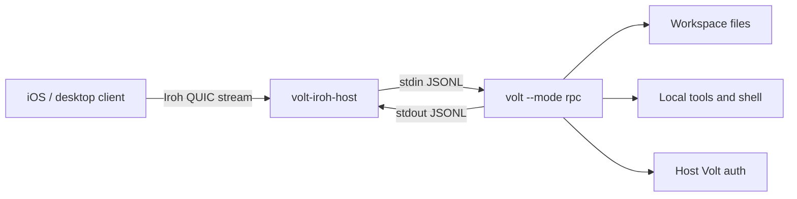

# Iroh Remote Access Design

## Status

Design proposal and proof-of-concept plan. No Volt core behavior is changed by this document.

## Summary

Add an optional native sidecar that exposes Volt's existing RPC protocol over [Iroh](https://www.iroh.computer/blog/v1). The first proof of concept should keep Iroh out of Volt core: a separate `volt-iroh-host` process accepts Iroh connections, spawns `volt --mode rpc`, and bridges JSONL between the Iroh stream and the child process stdio.

This turns Volt into a remotely reachable local coding agent without requiring users to open ports, configure reverse proxies, or move provider credentials to a mobile client. A future iOS app can use Iroh Swift support to connect to the user's host machine and render a native UI from RPC events.

## Background

Volt already has three relevant layers:

- `AgentSession` and the SDK for embedding Volt in Node.js applications.
- RPC mode (`volt --mode rpc`) for language-agnostic clients over LF-delimited JSONL.
- Extension UI requests in RPC mode, so remote clients can respond to confirmation, input, and selection prompts.

Iroh v1 provides key-based dialing, encrypted QUIC connections, NAT traversal, local-first discovery, relay fallback, and stable v1 wire compatibility. The v1 announcement also calls out official Rust, Node.js, Swift, Kotlin, and Python support, which matches a host-side native daemon plus future mobile clients.

## Goals

- Enable remote access to a local Volt session from another device without port forwarding.
- Keep model credentials, repository files, and tool execution on the host machine.
- Reuse Volt RPC as the application protocol instead of inventing a new agent protocol.
- Keep the initial proof of concept optional and isolated from core packages.
- Define a security model before exposing shell/file tools remotely.

## Non-goals

- No TUI tunneling.
- No mobile app implementation in the first proof of concept.
- No built-in sandbox. Remote Volt has the same local-agent risks described in [Security](security.md).
- No Iroh dependency in `@earendil-works/volt-coding-agent` during the first proof of concept.
- No multi-user collaboration semantics in the first proof of concept.

## Current State

RPC mode is bound to process stdin/stdout today:

```text
client process
  -> JSONL stdin
volt --mode rpc
  -> JSONL stdout
```

This is enough for a sidecar bridge. Longer term, the RPC implementation can be refactored to accept an abstract duplex transport, but that is not required for the first proof of concept.

## Proposed Architecture



The sidecar owns network connectivity, pairing, client authorization, workspace selection, and child process lifecycle. The child `volt --mode rpc` process remains responsible for agent state, tools, model calls, sessions, extensions, and RPC semantics.

## Minimal Sidecar Proof of Concept

### Host command

```bash
volt-iroh-host serve --workspace volt=C:\Users\Jordan\source\repos\Volt
```

The host process:

1. Creates or loads a persistent Iroh endpoint key from `~/.volt/agent/remote/iroh-host.key`.
2. Validates the selected workspace path and child RPC executable before printing a ticket.
3. Starts an Iroh endpoint using the default relay/discovery configuration.
4. Prints a pairing ticket as text and QR payload.
5. Waits for one client connection.
6. Validates the pairing secret.
7. Spawns `volt --mode rpc --session-dir <host-session-dir>` in the selected workspace.
8. Pipes Iroh stream bytes to child stdin and child stdout bytes back to the Iroh stream.
9. Logs child stderr and sidecar diagnostics to `~/.volt/agent/remote/iroh-host.log`.

### Client command

```bash
volt-iroh-client connect <pairing-ticket>
```

The client process:

1. Opens an Iroh endpoint.
2. Dials the host ticket.
3. Sends a JSON handshake containing the pairing secret, requested workspace name, client label, and protocol version.
4. Sends normal Volt RPC JSONL commands after the host accepts.
5. Renders RPC events in a minimal terminal UI or prints text deltas for the proof of concept.

### Pairing ticket shape

Use an opaque URL-safe payload so the format can change:

```text
volt+iroh://v1/<base64url-json>
```

Initial ticket payload fields:

```json
{
  "nodeId": "<iroh-node-id>",
  "workspace": "volt",
  "secret": "<one-time-secret>",
  "expiresAt": 1790000000000,
  "alpn": "volt-rpc/0"
}
```

The host must treat the ticket secret as one-time. After successful pairing, persist the client node ID and require that ID for later connections.

### Stream protocol

After the handshake succeeds, the stream carries the same LF-delimited JSONL described in [RPC mode](rpc.md). The sidecar should not parse normal RPC commands for the proof of concept except to support connection-level shutdown and logging. It should preserve strict LF framing and not use generic line readers that split on Unicode separators.

### Process model

Proof-of-concept defaults:

- One Iroh connection maps to one `volt --mode rpc` child process.
- One workspace per child process.
- Child exits when the Iroh connection closes.
- Host terminates the child on disconnect after a short grace period.
- Reconnect/resume is deferred; saved Volt sessions still work through normal session files.

## Security Model

Remote access to Volt is remote access to local files, shell commands, provider credentials, extensions, and project toolchains. The proof of concept must be explicit about that risk.

Required controls before any public release:

- Opt-in only. No listener starts unless the user runs the host command.
- Explicit pairing using a one-time secret.
- Persistent allowlist of paired client node IDs.
- Workspace allowlist. Remote clients choose from names, not arbitrary host paths.
- Client revocation command.
- Host-side audit log for connections, workspace selection, child process start/stop, and rejected attempts.
- No automatic `--approve`. Project trust should inherit existing Volt behavior unless the host user explicitly approves a workspace.
- Clear warning that `bash`, `write`, and `edit` allow remote modification of the host machine.

Recommended proof-of-concept safety default:

```bash
volt --mode rpc --tools read,grep,find,ls
```

Add an explicit host flag for write/shell access:

```bash
volt-iroh-host serve --workspace volt=. --allow-tools read,grep,find,ls,bash,edit,write
```

## Configuration

Suggested host config path:

```text
~/.volt/agent/remote/iroh-host.json
```

Suggested shape:

```json
{
  "hostName": "home-desktop",
  "workspaces": [
    { "name": "volt", "path": "C:\\Users\\Jordan\\source\\repos\\Volt" }
  ],
  "clients": [
    {
      "nodeId": "<client-node-id>",
      "label": "Jordan iPhone",
      "allowedWorkspaces": ["volt"],
      "allowedTools": ["read", "grep", "find", "ls"]
    }
  ]
}
```

## CLI UX

Initial external commands:

```bash
volt-iroh-host serve --workspace volt=/path/to/repo
volt-iroh-host pair --workspace volt
volt-iroh-host clients list
volt-iroh-host clients revoke <node-id>
volt-iroh-client connect <ticket>
```

Future integrated Volt commands:

```bash
volt remote host --workspace volt=/path/to/repo
volt remote pair --workspace volt
volt remote clients
volt remote revoke <node-id>
```

## Implementation Plan

### Phase 0: External sidecar, no Volt core changes

- Create a separate proof-of-concept package or repository for `volt-iroh-host` and `volt-iroh-client`.
- Use Iroh's stable Rust API first, or verify the Node.js binding API and use it if it is mature enough for the bridge.
- Spawn the installed `volt` binary with `--mode rpc`.
- Bridge bytes with backpressure handling.
- Support one workspace, one client, one session.
- Demonstrate prompt, streaming output, abort, model list, and read-only tools.

### Phase 1: Monorepo experiment

- Add an example under `packages/coding-agent/examples/remote/iroh-sidecar/` if the external proof of concept is successful.
- Keep native dependencies out of the default install path.
- Document setup, pairing, and security warnings.

### Phase 2: RPC transport extraction

Refactor RPC internals so stdin/stdout is one adapter:

```typescript
interface RpcTransport {
  write(value: object): Promise<void> | void;
  onLine(handler: (line: string) => void): () => void;
  close(): Promise<void> | void;
}
```

Then add adapters:

- stdio adapter for current `volt --mode rpc`.
- in-process adapter for SDK consumers.
- Iroh adapter if native dependency strategy is acceptable.

### Phase 3: Productized remote mode

- Add `volt remote ...` commands.
- Add reconnect/resume semantics.
- Add remote-safe response filtering where needed, such as hiding full host session paths from untrusted clients.
- Add mobile-oriented event batching and attachment transfer.
- Consider Iroh blobs for large images, logs, or session exports.

## Testing and Validation

Proof-of-concept validation:

- Pair a client and host on the same LAN.
- Pair a client and host across different networks using relay fallback.
- Send `get_state`, `get_available_models`, `prompt`, `abort`, and `get_messages` RPC commands.
- Verify assistant streaming events arrive in order.
- Verify extension UI requests can round-trip through the client.
- Verify child process exits when the Iroh stream closes.
- Verify unpaired clients are rejected.
- Verify a missing workspace path or Volt executable fails before printing a pairing ticket.
- Verify a client cannot request a workspace outside the host allowlist.

Automated tests for a monorepo version:

- Unit-test handshake parsing, ticket expiry, and client allowlist checks.
- Unit-test JSONL bridging with embedded `U+2028` and `U+2029` inside JSON strings.
- Integration-test the sidecar bridge against a fake child process before testing against Volt RPC.
- Integration-test against Volt's faux provider from the coding-agent test harness where possible.

## Risks

| Risk | Mitigation |
| --- | --- |
| Remote access exposes local shell and filesystem | Opt-in host command, read-only tool default, workspace allowlist, client revocation, clear warnings |
| Native dependency increases install complexity | Keep sidecar external or optional until the API and packaging story are proven |
| Mobile networks disconnect often | Add reconnect/resume after the initial proof of concept |
| RPC responses expose host paths | Document for PoC; add filtering or remote-safe state views before productization |
| Relay fallback may add latency or cost | Prefer direct connections, expose connection diagnostics, allow custom relay config later |
| Project extensions can run arbitrary code | Preserve project trust behavior and do not auto-approve remote workspaces |

## Open Questions

- Should the long-term host be a Rust binary, a Node.js package using Iroh Node bindings, or both?
- Should remote clients be limited to read-only tools by default even after pairing?
- How should mobile clients display and approve extension UI prompts?
- Should sessions created over remote access be tagged as remote in session metadata?
- What host path information should be hidden or normalized for remote clients?
- Should pairing be per-workspace or per-host with workspace-specific authorization?

## References

- [Iroh 1.0 announcement](https://www.iroh.computer/blog/v1)
- [RPC mode](rpc.md)
- [SDK](sdk.md)
- [Security](security.md)
