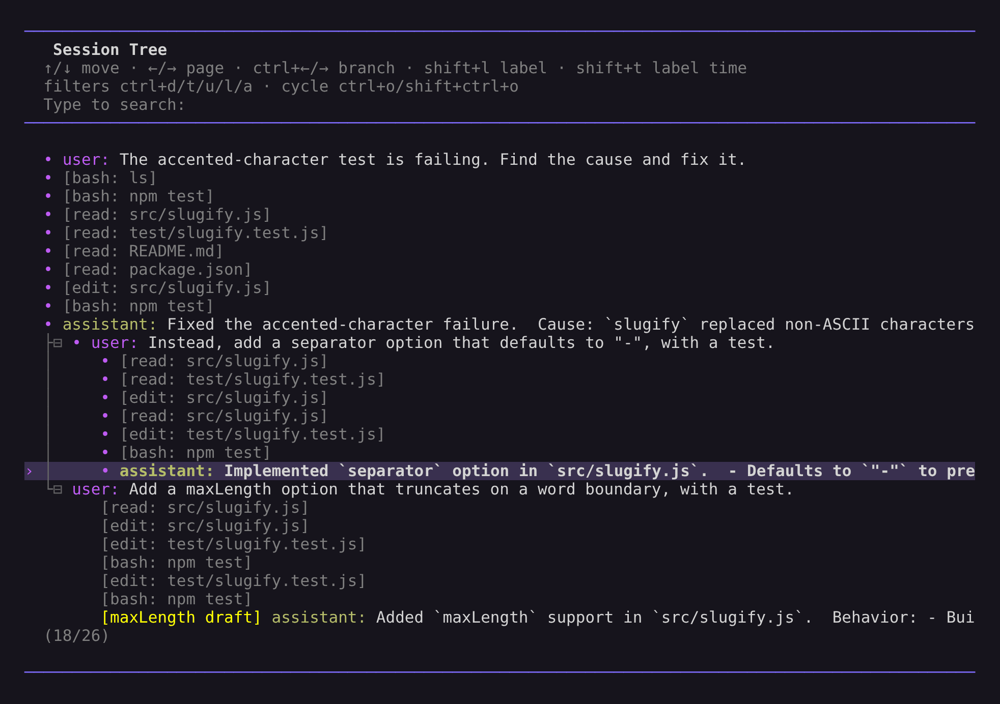

# Sessions

Volt saves conversations as sessions so you can continue work, branch from earlier turns, and revisit previous paths.

## Session Storage

Volt stores each workspace's sessions in `sessions.sqlite` under its directory in `~/.volt/agent/sessions/`. A custom `--session-dir` contains its own `sessions.sqlite`. This SQLite database is the live authoritative store; sessions are addressed by stable IDs instead of live files.

```bash
volt -c                  # Continue most recent session
volt -r                  # Browse and select from past sessions
volt --no-session        # Ephemeral mode; do not save
volt --name "my task"    # Set session display name at startup
volt --session <id|path> # Resume by partial ID, or import a JSONL snapshot by path
volt --fork <id|path>    # Fork by partial ID, or import a JSONL snapshot as a new session
```

Use `/session` in interactive mode to see the current store directory, session ID, message count, tokens, and cost.

JSONL is not live storage. It is used only for explicit snapshot import and export; passing a path to `--session` or `--fork` imports a current `snapshotVersion: 1` snapshot into SQLite as a new session (see [Fork Lineage](#fork-lineage)).

Session listing, exact-ID resolution, continuation candidate selection, and remote discovery read materialized summaries without loading transcript entries. Picker search is a deep scan over extracted user, assistant, and displayed custom-message text. It processes one session document at a time, but latency still grows with searchable history and query complexity; JavaScript regex searches have no general runtime bound.

For storage, snapshots, and the `SessionManager` API, see [Session Format](session-format.md).

### One Volt Process per Session

A session can be open for writing in only one Volt process at a time: the interactive TUI, `volt -p`, `--mode json`, `--mode rpc`, an SDK embedding, a subagent, or a daemon conversation a phone is using. Each takes an exclusive lock on `<session dir>/locks/<sha256(session id)>.lock` before it opens the session and holds it until it closes the session; the operating system releases it if the process exits. Taking the lock never waits.

Opening a session that is already open elsewhere fails with a `conversation_locked` error that names the session:

```text
Session <id> is open in another Volt process. Quit that session there (or switch it to another session), then retry. Listing, searching, and exporting it still work.
```

Quit the session in the other process, or switch that process to another session, then retry. RPC clients receive `errorCode: "conversation_locked"`, and phones receive the `conversation_locked` handshake outcome.

Listing and searching read store summaries, and exporting and forking from a session open it read-only: none of them take the lock, so they keep working while the session is open elsewhere. SDK code reads a session the same way with `SessionManager.openReadOnly(ref)`; every write through a read-only manager throws. Renaming or deleting another session from the picker takes its lock briefly and fails while that session is open in another process.

When the interactive TUI opens a session that the daemon is hosting for a phone, at startup or with `/resume`, it first takes the daemon's conversation lease. If the phone's turn is still running, the TUI waits until the turn finishes and the daemon closes its copy: the interrupt key (Escape by default) stops that turn, and Ctrl+C cancels opening the session, leaving the TUI where it was. If another TUI has the session open, it refuses with a message. The session the TUI leaves goes back to the daemon once it closed, so phones on it keep using it.

### When a Session Stops

Every write to a session names the log position it expects (see [Session Format](session-format.md#the-conversation-log)). If a write finds that another writer appended, that the session was deleted, or that its own outcome cannot be resolved, the session's log is lost: Volt cannot confirm what was saved, so it stops that session instead of continuing.

- The TUI exits with `Volt stopped this session because its saved state could not be confirmed`, suggests `/resume`, and prints any unsent editor text so you can copy it.
- `volt -p`, `--mode json`, and `--mode rpc` print `Volt stopped session <id> because its saved state could not be confirmed: <reason>` and exit with code 1.
- The daemon closes the conversation.

Extensions observe the stop through the aborted `ctx.signal` of their commands and then receive `session_shutdown`; session writes after the stop throw. Reopen the session with `/resume` or `--session` to continue from what was saved.

## Session Commands

| Command | Description |
|---------|-------------|
| `/resume` | Browse and select previous sessions |
| `/clear` | Start a new session |
| `/name <name>` | Set the current session display name |
| `/session` | Show session info |
| `/tree` | Navigate the current session tree |
| `/fork` | Create a new session from a previous user message |
| `/clone` | Duplicate the current active branch into a new session |
| `/compact [prompt]` | Summarize older context; see [Compaction](compaction.md) |
| `/import <file>` | Import a JSONL snapshot as a new session |
| `/export [file]` | Export session to HTML |
| `/share` | Upload as private GitHub gist with shareable HTML link |

### Work and Switching Sessions

Background jobs, subagents, reviews, host actions, and extension work are work items of the session that started them (see [Session Format](session-format.md#work-entries-host-only)); `/work` lists them. While work runs, `/clear`, `/resume`, `/fork`, `/clone`, and `/import` refuse to leave the session: cancel the work in `/work` or wait for it to finish. Work suspended since a restart, such as a subagent that was running when Volt stopped, does not hold the session; it stays in `/work` until you resume or cancel it.

## Resuming and Deleting Sessions

`/resume` opens an interactive session picker for the current project. `volt -r` opens the same picker at startup.

In the picker you can:

- search by typing
- toggle path display with Ctrl+P
- toggle sort mode with Ctrl+S
- filter to named sessions with Ctrl+N
- rename with Ctrl+R
- delete with Ctrl+D, then confirm

When available, volt exports a JSONL snapshot to the system trash before deleting the session from SQLite.

## Naming Sessions

Use `/name <name>` to set a human-readable session name:

```text
/name Refactor auth module
```

Set the name at startup with `--name` or `-n`:

```bash
volt --name "Refactor auth module"
volt --name "CI audit" -p "Review this build failure"
```

Named sessions are easier to find in `/resume` and `volt -r`.

## Branching with `/tree`

Sessions are stored as trees. Every entry has an `id` and `parentId`, and the current position is the active leaf. `/tree` lets you jump to any previous point and continue from there without creating another session.

<p align="center"></p>
<p align="center"><em><code>/tree</code> in Volt 0.2.1 after rewriting an earlier prompt. Both branches remain in the same session.</em></p>

Example shape:

```text
├─ user: "Hello, can you help..."
│  └─ assistant: "Of course! I can..."
│     ├─ user: "Let's try approach A..."
│     │  └─ assistant: "For approach A..."
│     │     └─ user: "That worked..."  ← active
│     └─ user: "Actually, approach B..."
│        └─ assistant: "For approach B..."
```

### Tree Controls

| Key | Action |
|-----|--------|
| ↑/↓ | Navigate visible entries |
| ←/→ | Page up/down |
| Ctrl+←/Ctrl+→ or Alt+←/Alt+→ | Fold/unfold or jump between branch segments |
| Shift+L | Set or clear a label on the selected entry |
| Shift+T | Toggle label timestamps |
| Enter | Select entry |
| Escape/Ctrl+C | Cancel |
| Ctrl+O | Cycle filter mode |

Filter modes are: default, no-tools, user-only, labeled-only, and all. Configure the default with `treeFilterMode` in [Settings](settings.md).

### Selection Behavior

Selecting a user or custom message:

1. Moves the leaf to the selected message's parent.
2. Places the selected message text in the editor.
3. Lets you edit and resubmit, creating a new branch.

Selecting an assistant, tool, compaction, or other non-user entry:

1. Moves the leaf to that entry.
2. Leaves the editor empty.
3. Lets you continue from that point.

Selecting the root user message resets the leaf to an empty conversation and places the original prompt in the editor.

## `/tree`, `/fork`, and `/clone`

| Feature | `/tree` | `/fork` | `/clone` |
|---------|---------|---------|----------|
| Output | Same session | New session | New session |
| View | Full tree | User-message selector | Current active branch |
| Typical use | Explore alternatives in place | Start a new session from an earlier prompt | Duplicate current work before continuing |
| Summary | Optional branch summary | None | None |

Use `/tree` when you want to keep alternatives together. Use `/fork` or `/clone` when you want a separate session ID.

### Fork Lineage

A forked, cloned, or imported session does not read its source. Its log starts with a `forked_from` entry that names the source session and the entry the copy ends at, followed by a copy of the source's branch from the root to that entry and the labels on it. The copied entries keep their IDs. Other branches of the source stay only in the source.

| Source | Copied branch | `forked_from` names |
|--------|---------------|---------------------|
| `/fork` on a user message | Up to the entry before the message, which goes to the editor | The session and that entry, or no entry when the message is the first entry |
| `/clone` | Up to the current leaf | The session and its leaf |
| `--fork <id>` | The source's active branch | The source and its leaf |
| `/import`, or a path to `--session` or `--fork` | The snapshot's active branch | The snapshot's session ID and leaf |

An imported session gets a new ID. With `--fork <path>`, `--session-id` chooses it instead. A snapshot's parent locator is not carried into the imported session; its lineage names the snapshot.

Only the branch's public entries are copied. Host records stay with the source: a copy carries no work items, and the review runs it copies are local reports, linked to neither the source review's General nor its finding discussions. A review finding discussion cannot be forked or cloned; reset it from the source review instead.

## Branch Summaries

When `/tree` switches away from one branch to another, volt can summarize the abandoned branch and attach that summary at the new position. This preserves important context from the path you left without replaying the whole branch.

When prompted, choose one of:

1. no summary
2. summarize with the default prompt
3. summarize with custom focus instructions

See [Compaction](compaction.md) for branch summarization internals and extension hooks.

## Session Format

Each session in the SQLite store is a log of entries: messages, model, thinking-level, and Fast mode changes, plan state, labels, compactions, branch summaries, extension entries, and host-only records such as branch moves, queued input, fork lineage, work items, and review state. Explicit JSONL snapshots serialize the public session tree for interchange; they are not reopened as live storage.

For the log format, snapshot parsers, and the full `SessionManager` API, see [Session Format](session-format.md).
