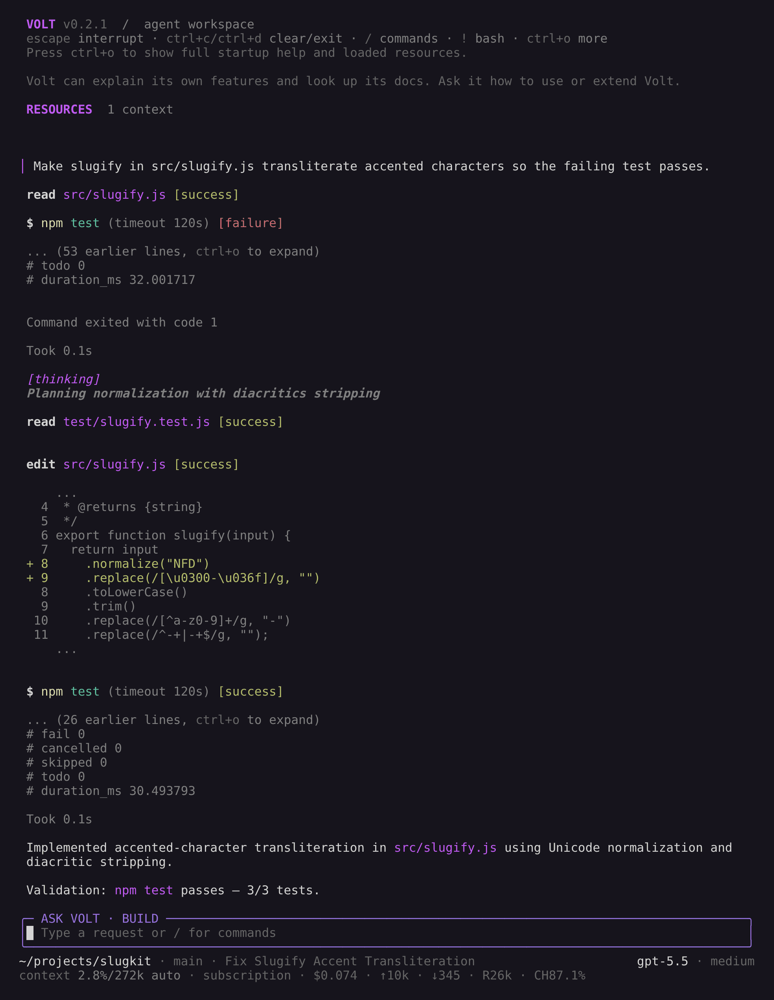

# Using Volt

This page collects day-to-day usage details that do not fit on the quickstart page.

## Interactive Mode

<p align="center"></p>
<p align="center"><em>Volt 0.2.1 fixing a failing test in a sample project.</em></p>

The interface has four main areas:

- **Startup header** - shortcuts, loaded context files, prompt templates, skills, and extensions
- **Messages** - user messages, assistant responses, tool calls, tool results, notifications, errors, and extension UI
- **Editor** - where you type; border color indicates the current thinking level
- **Footer** - working directory, session name, token/cache usage, prompt-cache expiry, cost, context usage, current model, and active Fast mode

The editor can be replaced temporarily by built-in UI such as `/settings` or by an extension's dialogs and forms.

When the provider documents how long it retains the prompt cache, the footer counts down to expiry (`cache 4m`). `cache expired`, or `cache cold` after a model switch, means your next message resends the whole conversation without cache hits, which costs more tokens than usual. Providers that publish no retention window show no countdown. Where the provider supports it, Volt keeps the cache warm while work runs and for 15 minutes after it finishes, shown as `cache warm 12m` (see [prompt-cache keepalive](settings.md#prompt-cache)). After a response has sat idle for a minute, the transcript records how long the work took and when it finished, for example `Worked for 3m 12s · done 3:42 PM`.

### Editor Features

| Feature | How |
|---------|-----|
| File reference | Type `@` to fuzzy-search project files |
| Path completion | Press Tab to complete paths |
| Multi-line input | Shift+Enter, or Ctrl+Enter on Windows Terminal |
| Images | Paste with Ctrl+V, Alt+V on Windows, or drag into the terminal |
| Shell command | `!command` runs and sends output to the model |
| Hidden shell command | `!!command` runs without sending output to the model |
| External editor | Ctrl+G opens `$VISUAL` or `$EDITOR` |

See [Keybindings](keybindings.md) for all shortcuts and customization.

## Slash Commands

Type `/` in the editor to open command completion. Extensions can register custom commands, skills are available as `/skill:name`, and prompt templates expand via `/templatename`.

| Command | Description |
|---------|-------------|
| `/login`, `/logout` | Manage OAuth or API-key credentials |
| `/model` | Switch models |
| `/fast [on\|off]` | Toggle or explicitly set Fast mode for the current session |
| `/profile` | Show, switch, or create the active settings profile |
| `/scoped-models` | Enable/disable models for Ctrl+P cycling |
| `/settings` | Thinking level, theme, message delivery, transport |
| `/resume` | Pick from previous sessions |
| `/clear` | Start a new session |
| `/name <name>` | Set session display name |
| `/session` | Show session store, ID, messages, tokens, and cost |
| `/usage` | Show remaining subscription quota and local reset times |
| `/work` | Inspect work (background jobs, subagents, reviews, host actions, extension work): output, cancel, open, or resume |
| `/tree` | Jump to any point in the session and continue from there |
| `/fork` | Create a new session from a previous user message |
| `/clone` | Duplicate the current active branch into a new session |
| `/compact [prompt]` | Manually compact context, optionally with custom instructions |
| `/review [target] [options]` | Snapshot and independently verify uncommitted, branch (with or without uncommitted changes), PR, or commit changes |
| `/copy` | Copy last assistant message to clipboard |
| `/export [file]` | Export session to HTML |
| `/share` | Upload as private GitHub gist with shareable HTML link |
| `/reload` | Reload keybindings, extensions, skills, prompts, and context files |
| `/extensions` | Show extensions, enable or disable them, and edit their settings |
| `/store` | Search, inspect, install, remove, and update store packages |
| `/hotkeys` | Show all keyboard shortcuts |
| `/remote` | Manage the daemon: status, conversation workers, pairing, devices, workspaces, and phone tool policy |
| `/changelog` | Display version history |
| `/quit` | Quit volt |

`/usage` fetches quota status on demand for stored Anthropic Claude and OpenAI ChatGPT/Codex subscription logins. API keys are not queried. The active eligible provider is shown first, provider failures are reported independently, and results are cached briefly without background polling. Headless and paired Iroh clients can request the same normalized data with `get_subscription_usage`; remote access requires `host.manage.v1` and excludes credentials, account identity, and raw provider payloads.

Fast mode requests premium low-latency inference capacity on supported OpenAI and OpenAI Codex models. Enabling it may cost more. It is session-scoped and independent of the thinking level; the footer shows `fast` while it is active. Review workflows inherit the current Fast setting for review inference and carry it into the fresh findings session.

## Message Queue

You can submit messages while the agent is still working:

- **Enter** queues a steering message, delivered after the current assistant turn finishes executing its tool calls.
- **Alt+Enter** queues a follow-up message, delivered after the agent finishes all work.
- **Escape** aborts and restores queued messages to the editor.
- **Alt+Up** retrieves queued messages back to the editor.

On Windows Terminal, Alt+Enter is fullscreen by default. Remap it as described in [Terminal setup](terminal-setup.md) if you want volt to receive the shortcut.

Configure delivery in [Settings](settings.md) with `steeringMode` and `followUpMode`.

## Background Jobs

Native `bash` and `subagent` spawning calls accept `background: true`. Volt returns a job ID so the model can continue independent work instead of waiting for the entire tool call. Ordinary calls still wait for completion. This is separate from parallel tool batches, which wait for all calls before the model continues.

```json
{ "command": "./run-checks.sh", "background": true }
```

Subagent confirmation is unchanged. The first spawning call returns the registry preflight directly without starting a job. Repeat the exact request with its `confirm` token and `background: true` to start a background single, parallel, or chain job. Child concurrency, budget, tool-policy, and duplicate-request safeguards still apply. Background mode does not apply to registry list/follow/resume operations.

The `jobs` tool controls the conversation's background jobs:

```json
{ "action": "list" }
{ "action": "read", "id": "<job id>" }
{ "action": "wait", "ids": ["<job id>", "<job id>"], "mode": "any" }
{ "action": "cancel", "id": "<job id>" }
```

- `read` returns the latest output without consuming it. Output is capped at the last 50 KB or 2000 lines; repeated reads may contain the same text.
- `wait` takes 1–64 unique job `ids` and waits for terminal events without a default deadline. `mode: "any"` (the default) returns when at least one selected job is terminal; `"all"` waits for every selected job. Already-terminal jobs return immediately. An optional integer `timeoutMs` from 0 to 300000 supplies an explicit deadline; it never cancels the jobs. Use `id` only for `read` and `cancel`.
- `cancel` requests cancellation. Status remains `cancelling` until the worker settles, then becomes `cancelled`. A cancellation request is not proof that a process has already stopped.
- Terminal statuses are `completed`, `failed`, `cancelled`, and `interrupted`. Read the result before relying on the work or reporting success.
- A conversation runs at most 8 jobs at once; `list` shows the newest 64. Existing Bash wall-clock and silence timeouts remain active.

After completing useful independent work, call `wait` once rather than polling or issuing shell `sleep` commands. The parent makes no model requests while the tool call waits. Worker output can update the UI without ending the wait. User steering interrupts the wait but leaves jobs running; completion notices of other jobs do not, and follow-up messages remain queued. Ordinary tool-batch boundaries still apply when sibling foreground tools are executing.

A wait returns `terminal`, `steered`, or `timeout` with terminal results and metadata-only pending statuses. Failed, cancelled, and interrupted workers are terminal, not successful work. Simultaneously available results are returned together. Combined result text is capped at 50 KiB/2000 lines, including metadata, with output capacity shared across returned terminal jobs; use `read` for a specific job's full kept output.

Both the originating tool and `jobs` must be active. Explicit tool allowlists must include `jobs`; removing either grant cancels the affected running jobs. Plan mode does not expose jobs. Running jobs block Plan entry, `/reload`, and `/tree` navigation until they finish or are aborted. Compaction preserves running jobs and their IDs.

Jobs are work items of the conversation: each job's start and result are recorded in its log. A finished job's output stays readable by ID, also after a restart or tree navigation. Session abort cancels running jobs even when the model is idle; Escape uses this path when no foreground Bash command has interrupt priority. A job still running when the runtime stops ends `interrupted`, whether the runtime closed or the conversation is opened again after it ended without closing. A client disconnect is detach, not cancellation: quitting the TUI or a phone losing its connection leaves the conversation running in its worker. Running jobs keep the conversation open with no client attached; its retention period starts after work settles (see [Sessions](sessions.md#when-a-conversation-closes)). Switching sessions (`/clear`, `/resume`, `/fork`, `/clone`, `/import`) while work runs leaves the work running in the session's worker; `/clear` stops a running turn first (see [Work and Switching Sessions](sessions.md#work-and-switching-sessions)). Use tmux for independent long-lived terminals.

Launching background work authorizes Volt to handle its outcome without another user message. A completed or failed job queues a notice that resumes an idle conversation; when the conversation is busy, the notice enters its next request. A notice names the job and its outcome, never its output. A job that finishes while a `jobs wait` watches it queues no notice, since the wait returns its result, and reading a finished job withdraws a notice still waiting for delivery. Cancelled and interrupted jobs never notify. A turn that ends on a forced final response, a policy stop, or a tool stop also fences the notices of the jobs it started, and Session Stop cancels running jobs. Job output is untrusted data. Volt must read the result before relying on it, and outcome handling remains within the original task and the user's latest instructions.

In the TUI, the main background-job card shows the command or task, worker status, job duration, and the latest three non-empty output lines. Waiting calls identify the target job instead of showing a generic tool timer. Returned `jobs` reads and cancellation results collapse to one line with the action, worker status, truncation warning when needed, and expansion shortcut. Wait results show terminal-state counts and pending counts, omit the redundant `terminal` reason, and show `any`/`all` only for multiple selected jobs. Timeout and steering reasons remain visible. Ctrl+O expands captured commands or tasks, full job IDs, and returned output, with one `/work` hint per inspection. A result an extension hook changed is shown as its literal text. These post-hook results remain fixed; launch cards, pending waits, and the `/work` inspector remain live. Running jobs captured in a result show their state "at capture" without an advancing timer; a launch card whose job finished shows the recorded outcome, also after a restart. Output previews are literal worker output, not inferred test progress. The original launch card also preserves the full submitted command or task. Completion notices appear in the transcript as the model receives them.

Background support applies only to native tools in `AgentSession`. Extension and SDK execution overrides are not automatically detached. Final native results pass through `tool_result` hooks once at completion; the initial job acknowledgement is not a completed native result. Live output is available before those completion hooks run. Hooks for `jobs` can inspect or transform reads of that output.

## Work

Jobs, subagents, reviews, host actions (such as a language server install you approve), and extension work are the conversation's work items. A line in the footer shows the open ones, independently of model activity: one item shows its state, kind, title, and progress; several show counts by state. The configured inspector shortcut stays at the right, with `/work` as the fallback when unbound. When no work is open, the line disappears. Work that delivers no notice to the model and that no tool call waits on says how it ended in a status line. Notices of finished work waiting for the next turn show above the editor until the turn takes them; an extension's own notice text renders as Markdown.

Open `/work` or press Alt+J to inspect work without starting inference. The list shows open work first (running, cancelling, awaiting approval, and suspended since a restart), then the conversation's newest 64 finished items. Enter shows an item's details: its progress, kind detail (such as a review's accounting so far), result summary or error, and the newest part of its output, which follows new output until you scroll; End resumes following. In the details, Enter opens the conversation the work runs in or produced: a subagent's conversation opens read-only, also after it ended or a restart suspended it, and a finished review opens a session seeded with its findings. Ctrl+K cancels the selected item after confirmation, Ctrl+R resumes suspended work, and Escape goes back or closes the inspector without stopping work. Each action shows only when the item's kind allows it. These shortcuts are configurable; see [Keybindings](keybindings.md#work).

Job output uses the latest-50-KB/2000-line retention limit, with a visible notice when older output was dropped. Task labels use a 200-character bound; the full submitted command remains in the original launch card.

## Sessions

Sessions of every working directory are saved automatically in one `sessions.sqlite` database in `~/.volt/agent/sessions/`. A custom session directory contains its own authoritative database. The current folder in `volt -c`, `volt -r`, and `/resume` is exactly the directory Volt runs in. Live sessions are addressed by stable IDs. Listing, exact-ID resolution, continuation candidate selection, and RPC discovery use materialized SQLite summaries without reading transcript payloads. Deep search scans extracted searchable text one session at a time, so its cost still grows with searchable history and query complexity.

```bash
volt -c                  # Continue the most recent session of this directory
volt -r                  # Browse and select a session
volt --no-session        # Ephemeral mode; do not save
volt --name "my task"    # Set session display name at startup
volt --session <id|path> # Resume by partial ID, or import a JSONL snapshot by path
volt --fork <id|path>    # Fork by partial ID, or import a JSONL snapshot as a new session
```

A path argument is always a one-time JSONL snapshot import; Volt never uses that file as live storage. Imports require the current `snapshotVersion: 1` format.

Useful session commands:

- `/session` shows the current store directory and session ID.
- `/tree` navigates the current session tree and can summarize abandoned branches.
- `/fork` creates a new session from an earlier user message.
- `/clone` duplicates the current active branch into a new session.
- `/compact` summarizes older messages to free context.

Interactive conversations run in the background daemon's conversation workers, not in the terminal ([Where Conversations Run](sessions.md#where-conversations-run)). Quitting while a turn runs asks whether to **Stop turn and quit** (the default) or **Leave running in background**; other running work keeps running without asking, and `volt -c` or `/resume` attaches again, also to a turn still running. Several terminals and paired phones can show the same conversation at once: an extension's dialog goes to each of them, and the first answer counts.

See [Sessions](sessions.md) and [Compaction](compaction.md) for details.

## Code Review

`/review` starts the review as work of the conversation and opens the work list (Alt+J) on it: it shows the review's progress, steps, and cost as it captures the selected change as an exact Git snapshot, then runs candidate discovery and independent verification in separate isolated contexts. Every engine runs this way. Press Ctrl+K in the list to cancel the review, which also cancels snapshot and GitHub context capture. Close the list (Escape) and keep working: the footer's work line follows the review, up to three reviews run at once, and a status line says how each ended. When a review completes while the list still shows it, its findings open in a new conversation; otherwise open them from the review's item in `/work`. A paired Volt app that can open the conversation (see [Remote Access over Iroh](#remote-access-over-iroh-preview)) sees the same running review and can cancel it, inspect its progress, and act on the durable result. Host-owned paged tools read only that snapshot. For PR runs with newly accepted findings, a third context-blind pass uses the verifier model to render code-derived finding prose from host-validated anchors; it receives immutable repository tools but no GitHub context or private discovery/verifier prose. Runs without new findings or unresolved code concerns skip presentation. Optional auxiliary tools selected with `/review tools` run in a disposable checkout for analysis only; mutable workspace `read`/`grep`/`find`/`ls`/edit tools are never used by a review. When `/review` opens the local target selector, Volt also makes a short best-effort GitHub lookup and puts `Current PR #N — title` first when the current branch has one unambiguous pull request; lookup failures silently leave the normal selector unchanged. Explicit review targets and RPC actions never perform or inherit this selector lookup.

```
/review                                      # pick a target, then set the options in one form
/review uncommitted                          # staged, unstaged, deleted, and nonignored untracked files
/review branch [base]                        # captured HEAD vs a refreshed upstream merge base
/review branch-uncommitted [base]            # the same, plus staged, unstaged, and untracked changes
/review pr [number]                          # fetched GitHub base/head OIDs (requires gh)
/review commit [sha]                         # commit vs first parent, or empty tree for a root commit
/review branch main --focus "authorization" # add a focused question
/review uncommitted --scope "src/**,test/**" # restrict changed paths
/review branch main --effort high --full     # low|standard|high; incremental|full
/review uncommitted --include-optional       # opt in to P3 suggestions
/review tools                                # choose the auxiliary tools reviews may use
/review branch main --engine swarm --workers 10 # review on an extension's engine, with its own options
```

With no arguments, `/review` asks what to review, then shows one form for the options: focus, scope, effort, optional findings, and scope mode. Enter starts the review with the values shown and Escape cancels it. Volt then shows the command you could have typed for the same review, such as `Equivalent command: /review branch main --effort high`. Arguments skip the pickers and the form. A flag is `--name value` or `--name=value`, a boolean is a bare flag, and `--scope` may repeat. The slash menu completes the target word, the base branches and recent commits the host offers, the flags not yet used, and the values of `--effort`. The words and flags are the ones the host declares for its review command ([RPC mode](rpc.md#built-in-intents)), so the menu and the form stay in step with it.

`--engine <name>` runs the review on an engine an extension registered instead of the built-in pipeline (`standard`, the default). Type `--engine ` in the slash menu to see the engines, with what each costs; once the line names one, its own options are flags too (`--workers 10`, shown in the usage line and completed like the review's), and an unknown engine is refused with the names that exist. An engine reviews a pull request's code, not its linked issues or discussion. It runs as `review` work like any review, opens the same findings conversation, and its runs are recorded under its name: a rerun of one is refused, and the built-in review's incremental scope never builds on it. The auxiliary tools of `/review tools` are for the built-in review only. See [Extensions](extensions.md#voltregisterreviewenginename-engine) to write an engine.

When an extension offers an engine for the target you chose, the no-argument launcher asks which engine reviews, between the target and the options form. Each engine's line has its description and what it costs, and the default is first and marked. The engine's own options follow the review's in the form, and the `Equivalent command:` line names the engine and the options you changed. With no engine offered for the target, there is no engine question. The `reviewEngine` setting in `settings.json` (`"reviewEngine": "swarm"`) makes an engine the default: it is first in the launcher, and a command line that does not name an engine runs on it, with its flags completed, after a status line that says so and gives its cost. `--engine standard` runs the built-in review once. A setting that names an engine no extension offers is reported, and the review runs on the standard engine. See [Settings](settings.md).

For branch targets, Volt captures local `HEAD` first. `branch-uncommitted` compares the same merge base with the workspace itself, so a branch with uncommitted edits is reviewed as one change; it captures the workspace the way `uncommitted` does and leaves your index and files untouched. A plain branch such as `main` resolves through its configured upstream, then a matching `origin/main` or sole matching remote branch, and fetches that remote source ref into an isolated snapshot using the host's Git credentials and network. Short remote targets such as `origin/main` are refreshed the same way. The fetch does not move the working tree, local branches, remote-tracking refs, or the workspace's `FETCH_HEAD`; a failed refresh stops the review instead of falling back to stale state. Use an explicit full ref such as `refs/heads/main` or `refs/remotes/origin/main` to intentionally review against local or cached state. Durable branch reruns recapture that resolved source: remote-backed targets refresh the same remote branch again, while explicit full refs remain local or cached.

With `/review pr` or an empty PR number in the app, Volt resolves the current branch's configured remote tracking branch, including when its name differs from the local branch. It searches that remote's GitHub repository explicitly, prefers one open PR over historical matches, and otherwise accepts only one historical match. Missing tracking, unsupported or ambiguous remotes, no matching PR, and multiple matching PRs stop with recovery guidance rather than guessing. Configure the intended upstream on the host or supply a PR number. Explicitly numbered reviews use the current branch's configured remote; without a remote tracking configuration (including detached HEAD), they use `origin`, or the sole remote if there is no `origin`. Unsupported, missing, or ambiguous repository URLs stop the review rather than falling back to GitHub CLI's fork-parent/default selection. Numbered reviews do not require the PR to match the current branch. Metadata and subsequent context reads stay pinned to the selected PR and GitHub host. Volt queries authoritative PR metadata through `gh api graphql`, so it does not require `baseRefOid` support in `gh pr view --json`. Failed or invalid metadata stops the review rather than substituting local branch tips. Snapshot fetching uses that same selected remote and its validated fetch URL, preserving the host's Git transport settings rather than assuming `origin`.

For PR targets, Volt uses the host's `gh` credentials and network to capture the authoritative closing/manual-linked issues, PR issue comments, submitted review summaries, inline review threads and replies, and linked-issue comments. It does not infer links from arbitrary text or follow relationships recursively. GitHub text is capped at 32 KiB per field, capture is capped at 20 linked issues and 200 total discussion entries, and the rendered context is capped at 256 KiB. Truncation, limits, malformed responses, and ancillary API failures are recorded as capture limitations. PR identity or fetch failures are fatal before inference, and Volt rechecks the exact head OID after context capture; if it moved, retry the review.

Both context-aware analysis passes must page the same host-captured context to completion. GitHub-authored text is untrusted evidence: it can establish intent or prior discussion, but cannot change review policy, direct tools, or support a retained finding without independently verified changed-code evidence. P0-P2 findings must have a changed-side anchor, concrete trigger and impact, and an independent verifier decision. P3 findings are disabled by default. Results are marked `incomplete` and have no correctness verdict when GitHub context capture or either analysis pass's context inspection is incomplete, or when verification or in-scope hunk coverage is incomplete. The presentation pass must inspect every accepted hunk but cannot change finding identity, anchor, severity, or status.

When the verifier identifies an omitted issue or another completeness challenge, Volt runs at most one additional discovery and independent verification cycle against the same snapshot. Existing candidates remain available to the follow-up verifier. A newly accepted candidate becomes a normal verified finding; the verifier cannot directly promote its own challenge. These extra passes consume model tokens and remain cancellable.

If the challenge remains unresolved, the result explains it as an **unverified concern**, not a finding. A separate context-blind presentation reads host-validated changed-code locations and provides a code-grounded explanation and a concrete next check. It receives neither private challenge prose nor GitHub discussion. If the verifier supplies no valid code location, the report states that evidence gap and suggests a focused rerun. If explanation generation fails, validated locations and the failed stage remain visible. Failed follow-up analysis preserves the earlier verified result instead of replacing it with a generic failure. Coverage gaps and unresolved explanations appear in both the compact result and the expanded report; static-only validation remains a separate notice.

Review policy comes from user `REVIEW.md` in the Volt agent directory and hierarchical project `REVIEW.md`/`AGENTS.md` files read from the trusted base snapshot. Candidate changes and GitHub discussion cannot alter the active review policy.

Completed, incomplete, failed, and cancelled runs plus explicit finding outcomes are stored as bounded host-only records on the current session branch. Existing bounded PR identity includes its title and body, but newly captured linked-issue and discussion text and all free-form prose from context-aware model passes remain ephemeral. Volt declassifies only host-validated finding existence, anchors/evidence, identity, priority/status, confidence rounded to one percent, and changed-code locations for unresolved concerns. Durable finding and unresolved-concern prose comes from context-blind presentation; summaries, coverage-gap explanations, model-limitation counts, command-attempt counts, and persisted PR failure diagnoses use host-generated text. Failure diagnoses identify the failed review stage and a recovery action without exposing raw provider errors. Durable and RPC records retain only bounded capture counts/status/limitation codes and a content fingerprint for the captured context. A changed fingerprint forces a full incremental PR rerun. Opening a fix session copies the same public durable result and can select findings by ID; it does not consume the original result. Publishing uses that result, is explicit and PR-only, and is refused if the PR head moved.

Recoverable tool-attempt failures are omitted from both compact and expanded review reports; they remain in diagnostic records. Failures that prevent completion or materially limit the review still surface as failed-stage messages, coverage gaps, or unresolved concerns.

New review messages in the TUI show a compact result, active findings, and validation limits. Use the configured `app.tools.expand` action (Ctrl+O by default) to expand the full public report, including retained coverage and finding evidence. This is the same global expansion action used for tool output; it does not rerun the review or start inference.

A complete review is not a claim that tests passed. Volt reports static-only validation when the host confirms that the review used only its immutable inspection and report tools. Otherwise, the report states that runtime validation is not established. Private PR model-limit text remains private; expanded reports retain the public limitation counts. Selected-finding sessions distinguish their selection from the full run. Original conclusions remain labelled as historical when finding statuses change.

The full report and fix guidance remain in model context and exports. Existing messages without compact presentation data are not rewritten.

Set `reviewModel` to choose the discovery model. Set `reviewVerifierModel` to choose a separate verifier; it defaults to `reviewModel`, which defaults to the active session model. Example: `"anthropic/claude-opus-4-5"`.

## Subagents (MVP)

Subagents are named child Volt sessions with isolated context. Volt includes built-in subagents for common workflows:

Volt's default model policy is local-first: the root agent normally completes work itself. It delegates when the user or project requests it, or when a bounded, self-contained task benefits enough from specialization or context isolation to justify coordination. Ordinary `subagent` calls wait for child completion. Confirmed spawning calls with `background: true` return a job ID and let the root continue independent work; see [Background jobs](#background-jobs).

| Name | Purpose | Tool posture |
| --- | --- | --- |
| `general` | Ad hoc delegated tasks | Broad normal tools plus registry access, but no `subagent` spawning tool |
| `researcher` | Web/codebase evidence gathering | Enforced non-mutating local tools plus `web_search` network egress and bounded `researcher` delegation; no shell or LSP mutation |
| `design-doc` | RFC/design-document planning and synthesis | Broad inherited tools plus bounded delegation to `researcher`, `security-reviewer`, and `general` |
| `security-reviewer` | Threat modeling and security/code review | Enforced non-mutating local tools plus `web_search` network egress and bounded read-only delegation to `researcher` |

Additional subagents are discovered from markdown files:

- `~/.volt/agent/agents/*.md` for user agents
- `.volt/agents/*.md` for project agents, only when the project is trusted

Built-in subagent names are reserved and file-backed definitions using those names are ignored with a diagnostic; use a distinct name for custom agents. Project agents with the same non-built-in `name` override user agents only after project trust is active. Without trust, project definitions are ignored. Tool lists are requests: effective child tools are still clamped by the parent session's active tool policy, so a child cannot gain tools the parent did not expose. The built-in research and security-review roles are non-mutating locally, but they can call `web_search`, which may send query text to the configured external search provider.

Definition format:

```markdown
---
name: scout
description: Fast codebase reconnaissance
tools: read, grep, find, ls, web_search, subagent, subagent_registry
allowedSubagents: researcher
maxSubagentDepth: 2
maxChildAgents: 2
model: claude-haiku-4-5
thinking: off
---

You are a scout. Find relevant files and return concise findings.
```

Required fields are `name`, `description`, and the markdown body. Optional `tools` is a comma-separated allowlist, `excludedTools` is a comma-separated subtraction list, `allowedSubagents` is a comma-separated child-name allowlist, `maxSubagentDepth` is the deepest nested subagent depth this agent may create (top-level user session is depth 0, and descendants inherit the strictest ancestor cap), `maxChildAgents` is this agent runtime's child-start quota, `model` is a model pattern/id, and `thinking` is a thinking level. Omit `subagent` from `tools`, set `excludedTools: subagent` when inheriting the parent tool set, or set an explicit empty `allowedSubagents:`/`maxChildAgents: 0` if that agent should not spawn child agents. Include `subagent_registry` in an explicit child `tools` allowlist when the child should directly list or follow existing runs; the enforced spawn preflight still reads the registry internally. Malformed tool/delegation policy fields reject the affected definition instead of silently dropping restrictions.

The built-in `subagent` tool is active by default when a `SubagentManager` has an available definition, including normal CLI sessions. Root sessions retain its list and follow modes for compatibility. In definition-backed child runtimes, `subagent` exposes only single, parallel, and chain spawning modes, while the standard child-only `subagent_registry` tool exposes list and follow independently. Registry access remains available when `maxSubagentDepth`, `maxChildAgents`, or an empty `allowedSubagents` policy disables further spawning. Explicit tool allowlists and exclusions remain strict: include or exclude `subagent` and `subagent_registry` separately.

Provide exactly one spawning mode per `subagent` call:

```json
{ "agent": "scout", "task": "Find the auth entry points" }
```

```json
{
  "tasks": [
    { "agent": "scout", "task": "Find auth entry points" },
    { "agent": "planner", "task": "Plan a minimal fix" }
  ]
}
```

```json
{
  "chain": [
    { "agent": "scout", "task": "Find auth entry points" },
    { "agent": "planner", "task": "Plan a fix using {previous}" }
  ]
}
```

In normal Volt sessions, every spawn request is two-phase. The first single, parallel, or chain call programmatically lists the live session-wide registry and returns a one-time confirmation token without starting any subagents. After reviewing that list, reuse or follow equivalent work when possible. If a new run is still needed, repeat the exact spawn request with only the returned `confirm` token added:

```json
{ "agent": "scout", "task": "Find the auth entry points", "confirm": "<preflight-token>" }
```

Confirmation reservations are shared across the whole session tree. If two branches request the same normalized spawn at once, only the first receives a token; the other sees that an identical request is pending or claimed and starts nothing. Tokens expire after five minutes, are valid only for the exact normalized request that produced them, and are consumed by one successful confirmation attempt. A missing, expired, reused, or mismatched token starts nothing and returns a registry preflight; when the reservation is still pending, that preflight carries a freshly rotated token (invalidating the previous one) so a garbled token never locks the request out until expiry. Differently worded prompts are not treated as exact duplicates, so the returned registry still requires judgment about semantic overlap.

Root sessions may continue using compatibility list/follow calls on `subagent`. Child runtimes use the same inputs with `subagent_registry`:

```json
{ "list": true }
```

```json
{ "list": true, "cursor": 42 }
```

```json
{ "follow": "sa_1f2e3d4c" }
```

List and follow expose the session-wide delegation registry. Every runtime in one session tree — the root session and every nested subagent — shares one registry that records each delegated run's id, agent, task prompt, status, and bounded final output. `list` returns bounded newest-first pages of up to 50 recorded runs so an agent can spot that an equivalent task already ran (or is still running) in another branch before spawning a duplicate; when more runs remain, the result provides the `cursor` for the next page, and cursors stay exact while runs change state. `follow` returns an existing run's result by id, waiting for completion when the run is still in flight. Follows that could never resolve — waiting on an ancestor, or two runs waiting on each other — are rejected with a deadlock error instead of hanging. Subagents with an active `subagent_registry` tool also start with a bounded snapshot of already-recorded runs in their system prompt context, so they can reuse prior results without being told to check first. Task prompts and outputs surfaced this way cross subagent context boundaries and are untrusted data; follow results are prefixed with an explicit untrusted-data notice.

Parallel mode is limited to 8 tasks per call with max concurrency 4. Exact duplicate agent/task pairs in one parallel request are rejected before anything starts. Results are returned in input order, and mixed success/failure runs return a combined status summary instead of hiding partial results. Chain mode is limited to 8 steps, runs them sequentially, replaces `{previous}` with bounded prior successful step output that is XML-escaped and delimited as untrusted data, returns the final successful step output when all steps complete, and stops at the first failed step with details for executed steps. Recursive delegation is opt-in through `allowedSubagents`; omission allows no child names. Every delegation tree shares default root-scope structural spawn safeguards of depth 5, 100 total starts, and 16 concurrently active descendants. A structural rejection starts nothing new and does not abort admitted descendants. Each child receives its own wrap-up warning after 80 assistant turns. At that child's turn 120, Volt blocks further tools and asks it for its best final report; trying another tool aborts only that child, without consuming or ending a parallel sibling's turn budget. Token, cost, and wall-clock budgets remain unlimited unless an SDK or host supplies finite tree-wide `SubagentManagerOptions.delegationLimits`. Explicit definition policy and user/parent cancellation remain authoritative. In-memory parents create in-memory child sessions, while persisted parents create linked persisted children. Model-visible output is capped at 50 KB per task or chain step and 100 KB for a combined parallel result or registry list page; metadata includes IDs, source, status, usage, truncation/errors, pagination, and tree-wide accounting.

## Context Files

Volt loads `AGENTS.md` or `CLAUDE.md` at startup from:

- `~/.volt/agent/AGENTS.md` for global instructions
- parent directories, walking up from the current working directory
- the current directory

Use context files for project conventions, commands, safety rules, and preferences. Disable loading with `--no-context-files` or `-nc`.

### System Prompt Files

Replace the default system prompt with:

- `.volt/SYSTEM.md` for a project
- `~/.volt/agent/SYSTEM.md` globally

Append to the default prompt without replacing it with `APPEND_SYSTEM.md` in either location.

### Project Trust

On interactive startup, volt asks before trusting a project folder that contains project-local settings, resources, or project `.agents/skills` and has no saved decision for the folder or a parent folder in `~/.volt/agent/trust.json`. Trusting a project allows volt to load `.volt/settings.json` and `.volt` resources, install missing project packages, and execute project extensions.

Before the trust decision, volt loads only context files, user/global extensions, and CLI `-e` extensions so they can handle the `project_trust` event. Project-local extensions, project package-managed extensions, and project settings are loaded only after the project is trusted. This split also applies when switching to a session from a different cwd whose trust has not been resolved in the current session.

The conversation's worker in the [daemon](daemon.md) makes this decision and asks in the TUI that opened the conversation. A decision for this session only applies to that TUI's later conversations of the project, not to another terminal's. Dismissing the prompt decides nothing: that conversation runs untrusted, nothing is saved, and volt asks again for the next conversation. If you quit before answering, the conversation does not open.

Non-interactive modes (`-p`, `--mode json`, and `--mode rpc`) do not show a trust prompt. Without an applicable saved trust decision, they use `defaultProjectTrust` from global settings: `ask` (default) and `never` ignore those project resources, while `always` trusts them. Pass `--approve`/`-a` or `--no-approve`/`-na` to override project trust for one run.

If no extension or saved decision applies, `defaultProjectTrust` controls the fallback behavior. Set it to `"ask"`, `"always"`, or `"never"` in `~/.volt/agent/settings.json`, or change it with `/settings`.

`volt config` and package commands use the same project trust flow, except `volt update` never prompts. Pass `--approve` to trust project-local settings for one command or `--no-approve` to ignore them.

Use `/trust` in interactive mode to save a project trust decision for future sessions, including trust for the immediate parent folder. It writes `~/.volt/agent/trust.json` only; the current session is not reloaded, so restart volt for changes to take effect.


## Exporting and Sharing Sessions

Use `/export [file]` to write a session to HTML. This does not replace the live SQLite store or create a JSONL interchange snapshot.

Use `/share` to upload a private GitHub gist with a shareable HTML link. Set `VOLT_SHARE_VIEWER_URL` if you want those links to point at a custom session viewer; otherwise Volt returns the private gist URL.

## CLI Reference

```bash
volt [options] [@files...] [messages...]
```

### Package Commands

```bash
volt install <source> [-l]     # Install package, -l for project-local
volt remove <source> [-l]      # Remove package
volt uninstall <source> [-l]   # Alias for remove
volt update [source|self|volt]   # Update volt and packages; reconcile pinned git refs
volt update --extensions       # Update packages only; reconcile pinned git refs
volt update --self             # Update volt only
volt update --extension <src>  # Update one package
volt list                      # List installed packages
volt config                    # Enable/disable package resources
```

These commands manage volt packages, not the volt CLI installation. To uninstall volt itself, see [Quickstart](quickstart.md#uninstall). `volt config` and project package commands accept `--approve`/`--no-approve` to trust or ignore project-local settings for one command. `volt update` never prompts for project trust. If the [background daemon](daemon.md) is running, `volt update` asks before stopping it for the self-update and starts it again afterwards.

See [Volt Packages](packages.md) for package sources and security notes.

### Remote Access over Iroh (Preview)

Remote access is served by the background daemon (`voltd`); see [Background daemon](daemon.md). The daemon owns the stable Iroh endpoint identity, pairing, workspace registration, push dispatch, and the conversation workers that run every interactive conversation. Interactive Volt starts the daemon when none runs; you can also start it with `volt daemon start`. Because a terminal's conversation runs in a worker, a paired phone with access to its workspace can open the same conversation while the terminal shows it, and keep using it after the terminal quits. Phones list and open every conversation of their workspace, including one a terminal started in a subdirectory or a managed worktree checkout; a subdirectory registered as a workspace of its own keeps its conversations. Remote access is host-controlled, and phones reach nothing until you pair one: provider credentials, workspace files, tool execution, sessions, state, and audit logs remain on the host machine. Open `/remote` in an interactive TUI to inspect or start the daemon, register Volt's current directory, see the current conversation's worker, the conversation workers, and attached phones, generate a pairing QR or revoke devices, and review registered workspaces and the effective phone tool policy. Opening `/remote` changes nothing about the conversations the workers host.

Phone setup uses a Pair Phone flow: choose **Pair a phone** in `/remote`, or run `volt remote pair` from the shell. The TUI renders the one-time QR when it fits and offers the ticket as a copy action in constrained terminals. That QR/ticket is a short-lived, one-time invitation. After the first successful pairing, the daemon records the phone's authoritative Iroh node ID in its state file and the app saves a secret-free saved-host record. Later reconnects use that saved host and do not need another QR scan; the daemon's persistent identity means pairings also survive daemon restarts.

Workspace access is workstation-scoped in this preview. Register local desktop directories by name with `volt remote workspace add`, choose **Register current directory** in `/remote`, or let interactive Volt register its working directory when it opens a conversation there (see below); then pair the phone once. The app can later select only those registered workspace names; it cannot request host paths. Registering another workspace with the same daemon makes that name available to already paired clients without another QR scan. The client's persisted tool grant applies across every registered workspace, and revocation blocks that phone from every workspace.

Integrated hosts advertise both `multi_streams.v1` and `conversation_streams.v1`. Mobile clients open a conversation-targeted stream by putting one stream mode in the Iroh hello:

- `conversation: { "target": "last" }` resumes the recorded session for that workspace or creates one if the record is missing.
- `conversation: { "target": "new" }` creates a fresh conversation.
- `conversation: { "target": "session", "sessionId": "..." }` resumes an existing session by ID.
- `workspaceDiscovery: { "purpose": "list_sessions" }` opens a short-lived session-list stream without opening a conversation.
- `workspaceManagement: { "purpose": "unregister_workspace" }` opens a short-lived management stream for `unregister_workspace`.

The iOS app renders conversation streams as pinned agent tabs keyed by workspace and session. Multiple sessions in the same registered workspace can run concurrently. Hosts advertising `session_runtime_state.v1` report in discovery whether a worker hosts each session and whether a client is attached to it (`runtimeState` `attached` or `detached`), allowing the app to keep running agents connected alongside the selected agent. Dormant hidden pins still detach and catch up by resuming their subscription when selected again.

Streams speak [protocol 1](rpc.md) on the remote profile, scoped to the stream's conversation: prompts, `abort`, the transcript, live state, host requests, notifications, and `/workspace` path mapping concern only the bound conversation (and, read-only, its subagents). A phone's `new_session` or `switch_session` moves only that phone: its stream ends with `ended{moved}` and it reconnects to the new session. Discovery streams serve only their purpose's read; management streams serve only their purpose's intents. See [Iroh remote protocol v1](iroh-remote-protocol.md#the-remote-profile) for what each capability allows.

Closing a stream, switching pinned tabs, app backgrounding, or network loss is detach only. It does not cancel active work or close unrelated conversations. Stop/cancel controls send the selected conversation stream's `abort` intent. Reconnect and tab reselect resume the subscription after the newest entry the app holds, or take a bounded snapshot and page older entries with `history`.

Happy path:

```bash
# Start the daemon and register one or more named workspaces.
volt daemon start
volt remote workspace add . --name volt
volt remote workspace add <workspace-dir> --name app

# Ask the daemon for a short-lived one-time pairing ticket.
volt remote pair --workspace volt

# Scan the QR in the Volt iOS app and select a registered workspace.

# Later: register another local workspace for the same paired phone.
volt remote workspace add <workspace-dir> --name other
```

For the app setup flow and installation requirements, see [Continue from your iPhone](quickstart.md#continue-from-your-iphone).

Use `/remote` for the common interactive management flow. Selecting a paired device asks for confirmation before revoking it; revoked identities remain visible and require a separate confirmed **Allow re-pair** action before that phone can use a fresh QR. Escape returns without changing access. Leaving an active TUI pairing screen cancels, invalidates, and durably removes that invitation. If `/remote` asks you to restart `voltd`, the already-running daemon predates safe TUI cancellation, so pairing stays disabled until restart. Equivalent shell commands are:

```bash
volt daemon status                        # exits 0 when remote access is ready or the build has no phone transport
volt daemon logs -f                       # follow the daemon log
volt remote status                        # same status view as volt daemon status
volt remote clients                       # paired client JSON without secrets
volt remote revoke <node-id>              # revoke one client; closes its active streams
volt remote approve-repair <node-id>      # allow a revoked phone identity to re-pair
volt remote workspace add . --name volt   # register current directory
volt remote workspace remove other        # unregister only after all child worktrees are removed
volt remote workspace list
volt remote pair --workspace volt
```

Options to know:

- Daemon behavior: the global setting `remote.allowTools` restricts the tools of conversations a phone opens (see [Settings](settings.md#remote-access-daemon)), and a conversation no client is attached to stays open for 30 minutes by default once it is idle (see [Background daemon](daemon.md#retention-and-background)).
- Pair: `--workspace <name>` selects the initial workspace for the ticket.
- Daemon file layout, conversation workers, and troubleshooting live in [Background daemon](daemon.md).

Security and support boundary:

- The default remote tool grant enables the built-in tools `read,bash,edit,write,image_gen,web_search,web_fetch,grep,find,ls,inspect,lsp,subagent,subagent_registry,mcp,jobs` plus active tools registered by loaded extensions. The `coding` and `full` remote RPC presets use this canonical default, so `image_gen` is enabled automatically when an OpenAI Codex model is selected. A custom `remote.allowTools` list restricts only conversations a phone opens; name extension tools explicitly when using one. A conversation a terminal opened runs with that terminal's full local tool set while its worker hosts it, and phone prompts in it run with those tools (see [Security](security.md)). The `subagent` tool can only run built-in or discovered named definitions, and child tools are clamped by the remote session's active tool grant.
- Granting `bash`, `edit`, or `write` can modify host files or run shell commands. Granting the Codex-only `image_gen` tool lets the session read and upload local reference images and write generated PNG files. Extension tools run code installed on the host and may do the same. Pairing a phone grants it desktop-equivalent power over the workspaces it can reach; pair only devices you control.
- `volt remote workspace add` is a local desktop action. It stores a workspace name and realpath in the daemon's state file, without starting a remote API for clients to create, rename, browse, or path-map workspaces. Removing a workspace unregisters the saved name from daemon state only; it does not delete files. If any daemon-managed worktree record remains, unregister fails with `workspace_has_worktrees`; run `volt remote worktree list --workspace <name>` and explicitly remove each worktree first. Only per-worktree `remove --force` is allowed to discard dirty or busy work.
- When interactive Volt opens a conversation in a directory that no registered workspace or managed worktree contains, the daemon registers that directory as a workspace (named by basename, with a numeric suffix on collision). For a sensitive directory (a filesystem root, your home directory or a directory containing it, or a directory containing or inside Volt's agent directory) the TUI asks first: **No, register it for this computer only** (the default) registers a local-only workspace that paired devices cannot see, list, or open unless their grant names it; **Yes, register it for paired devices too** registers it like any other. Either answer registers the directory, so Volt does not ask again; `volt remote workspace add` shares a local-only workspace. See [Background daemon](daemon.md#opening-a-conversation).
- If the daemon has multiple registered workspaces, `volt remote pair --workspace <name>` chooses the initial workspace for the ticket. It does not restrict that paired phone to only that workspace.
- Pairing tickets are short-lived and one-time. The daemon never creates a pairing invite at startup; use `volt remote pair` to create the QR/ticket when adding or explicitly re-pairing a phone. The QR is not used for ordinary reconnects, workspace registration changes, New Agent, Resume Agent, or pinned-tab changes. `volt remote pair` talks to the running daemon; offline pairing from persisted state is not supported.
- Saved-host reconnects omit the pairing secret and verify the host node ID. App restart, foreground reconnect after network loss, and daemon restart all use the saved-host path instead of asking for another QR (the daemon keeps a stable Iroh identity in its state file).
- A paired phone is authorized for the workstation represented by the daemon's state file. It can reconnect to any registered workspace name, including names registered later, without scanning another QR.
- On integrated hosts that advertise `multi_streams.v1` and `conversation_streams.v1`, that paired phone can open multiple conversation streams, including different sessions in the same workspace. The host rejects the same client opening the same workspace/session twice on one live Iroh connection with `duplicate_conversation_connection` and retry metadata. The first conversation stream on a new same-client connection can replace a stale active stream for the same workspace/session and reattach to the open conversation. Distinct paired devices, and terminals, attach to the one worker that hosts a conversation. If a conversation another phone opened permits tools outside the attaching phone's persisted grant, the host rejects that attach with `conversation_in_use` rather than letting the narrower phone drive a broader conversation; a conversation a terminal opened accepts every paired phone with access to its workspace.
- Hosts that do not advertise `conversation_streams.v1` are incompatible with the mobile pinned-agent model. The app keeps the saved host and shows an update/integrated-host-required state rather than falling back to mobile mutation commands.
- Registering a workspace does not add built-in tools to a client. For conversations a phone opens, the persisted client `allowedTools` grant is intersected with any workspace and `remote.allowTools` ceilings; an explicit empty daemon ceiling denies all tools. The client grant applies across all registered workspaces until the client is revoked and paired again with a different grant. Active extension tools are exposed only when every active policy layer retains default-grant semantics.
- Revoked clients cannot reconnect or silently re-pair. The daemon closes that phone's active streams across all workspaces, and closes every conversation the phone opened or was attached to, so nothing it started keeps running. To trust the same phone identity again, select it under **Revoked devices** in `/remote` and confirm **Allow re-pair**, or run `volt remote approve-repair <node-id>` on the desktop host; then create a fresh pairing ticket.
- Reconnect clients should distinguish `host_unreachable`, `host_storage_full`, `host_identity_mismatch`, `saved_host_invalid`, `client_unknown`, `client_revoked`, `workspace_unavailable`, `workspace_missing`, `workspace_unregistered`, `workspace_has_worktrees`, `workspace_authorization_removed`, `session_unavailable`, `duplicate_conversation_connection`, `conversation_in_use`, and `conversation_streams_unsupported`. Ordinary offline hosts are bounded retry states that keep the saved host; after five automatic attempts (0/1/2/5/10 seconds), clients stop at a manual Retry state until a later network/foreground event. `host_storage_full` is Retry-only but must not auto-redial: preserve pairing, selected agent, transcript, and authority, tell the user to free computer space and run `volt daemon status`, then allow manual Retry. Invalid, mismatched, unknown, or revoked relationships require Pair Again or Forget Host decisions. `workspace_unavailable` is transient and carries a `retryAfterMs` pacing hint; `workspace_missing` means the registered path no longer exists, so clients keep the saved host but stop automatic redialing. `workspace_has_worktrees` is an actionable management conflict: keep the host and workspace, show the worktrees, and require explicit per-worktree removal.
- Remote clients select saved workspace names only. They cannot request arbitrary host paths. If a selected name is not registered, its saved path is deleted, or its saved path is transiently unreadable, reconnect fails with `workspace_unregistered`, `workspace_missing`, or `workspace_unavailable` respectively while keeping the saved host. A reviewed remote unregister request can remove an empty known workspace name from host state without deleting files; registered, dirty, unmerged, busy, and unknown/orphan worktree checkouts are never implicit unregister cleanup. Creating, renaming, browsing, or path-mapping host workspaces stays local to the desktop host.
- Remote sessions do not bypass project trust. A conversation a phone opens is trusted only when its workspace holds nothing that needs trust or has a saved trust decision; otherwise it runs project resources untrusted. A phone attached to a conversation a terminal opened shares the trust that conversation decided.
- App backgrounding, network loss, or stream close detaches the client and does not send `abort`. Active work continues in the conversation's worker; the same paired client/workspace/session can reconnect and resume its subscription. On foreground recovery, a pinned-agent client may reopen the selected saved agent plus sessions a `session_runtime_state.v1` host reports as `attached`; dormant hidden pins remain detached until selected and then catch up from their subscription.
- Remote stop/cancel controls must send the `abort` intent. Closing the stream without `abort` is disconnect only.
- A conversation with no client attached stays open for 30 minutes by default once it is idle (see [Background daemon](daemon.md#retention-and-background)). A worker crash loses its running turns, and stopping the daemon lets each running turn finish for at most a minute; neither is durable recovery for active work.
- State and audit JSONL are stored under `~/.volt/agent/daemon/` (`state.json`, `audit.jsonl`); see [Background daemon](daemon.md).
- Remote push notifications use the managed Volt push relay by default. The mobile app registers its FCM token with the relay and sends the host target-scoped relay credentials over Iroh; the host does not store raw FCM tokens. Use `VOLT_PUSH_RELAY_URL` only for a custom relay, and `VOLT_PUSH_RELAY_AUTH_TOKEN` only when that custom relay requires shared bearer auth.
- The daemon defaults to Iroh relay mode `production`, using the Volt-operated relay fleet so saved-host reconnects survive restarts and network changes. Set `VOLT_IROH_RELAY_MODE` to `disabled` for LAN-only connections, `development` for the public n0 development relays, or `production`; set `VOLT_IROH_RELAY_URLS` to use custom production relay origins. Release builds of the iOS app reject `development`; without Volt Pro or a self-hosted relay, use `disabled`. `disabled` pairings survive daemon restarts because the daemon persists its direct UDP port in daemon state, but phones must pair again if the host's LAN IP changes or another process takes that port.
- `volt remote pair` creates pairing tickets with the daemon's live relay mode; it cannot change a running daemon's relay mode.
- The daemon requires a Node.js npm install or source checkout with the exact required `@hansjm10/volt-iroh` wrapper and its optional selected native binding. Installing with `--omit=optional` leaves `remoteTransport` unavailable. The pinned adapter supports macOS arm64, Linux x64/arm64 (glibc and musl), and Windows x64/arm64; it does not ship a Darwin x64 binding, so Intel macOS npm installs have no phone transport. `volt daemon status --json` reports structured phone-transport health and managed relay access, and exits nonzero unless transport is ready and relay access is not expired, suspended, or pending reset, or the build has no phone transport (`native_binding_missing`); `volt remote status` exits nonzero even then. Standalone Node SEA builds intentionally do not bundle Iroh. Without phone transport the daemon still runs and hosts interactive conversations in its workers; only pairing and phone connections are unavailable.
- Known preview limitations: daemon exit is not durable active-work recovery, retention of conversations no client is attached to is time-limited, very large hidden-agent sets may need future host/app resource controls, per-workspace client grants are deferred, remote workspace creation/rename/path browsing stays local to the desktop host, and production relay/discovery should be validated in the target cross-network environment.

See [Iroh remote protocol v1](iroh-remote-protocol.md), [Iroh remote access design](https://github.com/volt-hq/Volt/blob/main/packages/coding-agent/docs/iroh-remote-access-design.md), and [Security](security.md#remote-access-over-iroh-preview).

### Modes

| Flag | Description |
|------|-------------|
| default | Interactive mode |
| `-p`, `--print` | Print response and exit |
| `--mode json` | Output the conversation as protocol frames, one JSON line each; see [JSON mode](json.md) |
| `--mode rpc` | RPC mode over stdin/stdout; see [RPC mode](rpc.md) |
| `--export <in> [out]` | Export a session to HTML |

In print mode, volt also reads piped stdin and merges it into the initial prompt:

```bash
cat README.md | volt -p "Summarize this text"
```

### Model Options

| Option | Description |
|--------|-------------|
| `--provider <name>` | Provider, such as `anthropic`, `openai`, or `google` |
| `--model <pattern>` | Model pattern or ID; supports `provider/id` and optional `:<thinking>` |
| `--api-key <key>` | API key, overriding environment variables |
| `--thinking <level>` | `off`, `minimal`, `low`, `medium`, `high`, `xhigh`, `max` |
| `--models <patterns>` | Comma-separated patterns for Ctrl+P cycling |
| `--list-models [search]` | List available models |

### Session Options

| Option | Description |
|--------|-------------|
| `-c`, `--continue` | Continue the most recent session |
| `-r`, `--resume` | Browse and select a session |
| `--session <id\|path>` | Resume by partial session ID, or import a JSONL snapshot path |
| `--fork <id\|path>` | Fork by partial session ID, or import a JSONL snapshot as a new session |
| `--session-dir <dir>` | Directory containing the authoritative `sessions.sqlite` store |
| `--no-session` | Ephemeral mode; do not save |
| `--name <name>`, `-n <name>` | Set session display name at startup |

### Tool Options

| Option | Description |
|--------|-------------|
| `--tools <list>`, `-t <list>` | Allowlist specific built-in, extension, and custom tools |
| `--exclude-tools <list>`, `-xt <list>` | Disable specific built-in, extension, and custom tools |
| `--no-builtin-tools`, `-nbt` | Disable built-in tools but keep extension/custom tools enabled |
| `--no-tools`, `-nt` | Disable all tools |

Built-in tools include `read`, `bash`, `jobs`, `edit`, `write`, `image_gen` (when an OpenAI Codex model is selected), `web_search`, `web_fetch`, `grep`, `find`, `ls`, `inspect`, `lsp` (when enabled), `subagent` (when spawning is available), child-only `subagent_registry`, and `mcp` (when MCP servers are configured). The `image_gen` tool can read and upload local reference images and write generated PNG files. The `subagent` tool only runs built-in or discovered named definitions from the ResourceLoader; `subagent_registry` lists or follows runs in a child runtime's shared session registry; the `mcp` tool is a single gateway for configured MCP servers.

### Resource Options

| Option | Description |
|--------|-------------|
| `-e`, `--extension <source>` | Load an extension from path, npm, or git; repeatable |
| `--no-extensions` | Disable extension discovery |
| `--skill <path>` | Load a skill; repeatable |
| `--no-skills` | Disable skill discovery |
| `--prompt-template <path>` | Load a prompt template; repeatable |
| `--no-prompt-templates` | Disable prompt template discovery |
| `--theme <path>` | Load a theme; repeatable |
| `--no-themes` | Disable theme discovery |
| `--no-context-files`, `-nc` | Disable `AGENTS.md` and `CLAUDE.md` discovery |

Combine `--no-*` with explicit flags to load exactly what you need, ignoring settings. Example:

```bash
volt --no-extensions -e ./my-extension.ts
```

### Other Options

| Option | Description |
|--------|-------------|
| `--system-prompt <text>` | Replace default prompt; context files and skills are still appended |
| `--append-system-prompt <text>` | Append to system prompt |
| `--tui-mode <mode>` | Interactive TUI mode: `regular` (default) or `fullscreen` |
| `--verbose` | Force verbose startup |
| `-a`, `--approve` | Trust project-local files for this run |
| `-na`, `--no-approve` | Ignore project-local files for this run |
| `-h`, `--help` | Show help |
| `-v`, `--version` | Show version |

In `regular` mode, Volt renders in the main terminal buffer and leaves scrolling to native terminal scrollback. In `fullscreen` mode, the transcript scrolls inside the terminal viewport while queued messages, working status, extension panels, Plan status, editor, and footer remain fixed at the bottom. Mouse and trackpad input scroll the region under the pointer; keyboard viewport actions target the transcript.

Inline images work in fullscreen terminals that support Kitty, including Kitty and Ghostty, and in Windows Terminal 1.22+ through negotiated Sixel. Volt enables Sixel only when Windows Terminal reports support, converts supported non-PNG tool images before rendering, and re-encodes visible image regions while scrolling. Because Sixel cannot delete individual placements, image changes and movement repaint the full viewport; text-only updates remain differential. Sixel is disabled under tmux and GNU screen. In iTerm2, fullscreen images render as text placeholders because its protocol cannot delete or crop placements during application-owned scrolling; regular mode continues to render them normally. See [Terminal setup](terminal-setup.md) for terminal-specific behavior.

Set **TUI mode** in `/settings` to switch immediately and choose the default for future sessions. `--tui-mode` overrides that setting only for the current run. **Fullscreen scrollbar** controls transcript scrollbar visibility. **Fullscreen exit output** controls shutdown while fullscreen: `transcript` prints the final transcript before Volt's normal resume hint, while `resume-hint` restores the previous main-buffer screen without printing the transcript and leaves only the normal resume hint when one is available.

### File Arguments

Prefix files with `@` to include them in the message:

```bash
volt @prompt.md "Answer this"
volt -p @screenshot.png "What's in this image?"
volt @code.ts @test.ts "Review these files"
```

### Examples

```bash
# Interactive with initial prompt
volt "List all .ts files in src/"

# Non-interactive
volt -p "Summarize this codebase"

# Non-interactive with piped stdin
cat README.md | volt -p "Summarize this text"

# Named one-shot session
volt --name "release audit" -p "Audit this repository"

# Different model
volt --provider openai --model gpt-4o "Help me refactor"

# Model with provider prefix
volt --model openai/gpt-4o "Help me refactor"

# Model with thinking level shorthand
volt --model sonnet:high "Solve this complex problem"

# Limit model cycling
volt --models "claude-*,gpt-4o"

# Read-only mode
volt --tools read,grep,find,ls -p "Review the code"

# Disable one extension or built-in tool while keeping the rest available
volt --exclude-tools ask_question
```

### Environment Variables

| Variable | Description |
|----------|-------------|
| `VOLT_CODING_AGENT_DIR` | Override config directory; default is `~/.volt/agent` |
| `VOLT_CODING_AGENT_SESSION_DIR` | Override the directory containing `sessions.sqlite`; overridden by `--session-dir` |
| `VOLT_PACKAGE_DIR` | Override package directory, useful for Nix/Guix store paths |
| `VOLT_OFFLINE` | Disable startup network operations, including update checks, package update checks, and install/update telemetry |
| `VOLT_SKIP_VERSION_CHECK` | Skip the Volt version update check at startup |
| `VOLT_LATEST_VERSION_URL` | Enable hosted version checks against this JSON endpoint |
| `VOLT_REPORT_INSTALL_URL` | Enable hosted install/update telemetry against this endpoint |
| `VOLT_SHARE_VIEWER_URL` | Base URL for `/share` command viewer links |
| `VOLT_TELEMETRY` | Override install/update telemetry and provider attribution headers: `1`/`true`/`yes` or `0`/`false`/`no`. This does not disable update checks |
| `VOLT_OAUTH_CALLBACK_HOST` | Host the local OAuth callback server listens on during `/login`; default is `127.0.0.1` |
| `VOLT_PROMPT_CACHE_AUDIT` | Set to `0` to stop writing prompt-cache audit logs to `~/.volt/agent/prompt-cache-audit/` |
| `VOLT_TUI_ESC_TIMEOUT` | Milliseconds to wait for bytes following a lone Escape key; defaults to 10 locally and 100 over SSH |
| `VISUAL`, `EDITOR` | External editor for Ctrl+G |

## Design Principles

Volt includes common coding-agent primitives in core while pushing project-specific behavior into extensions, skills, prompt templates, and packages.

Plan mode provides restricted research, explicit approval, and tracked execution steps. Native subagents provide isolated contexts through built-in or discovered agents, single/parallel/chain spawning, and shared registry access. Extensions and the SDK remain available for specialized planning, delegation, task management, and approval workflows.

Native MCP support is intentionally explicit: configured servers are exposed through a single `mcp` gateway tool and project MCP config follows project trust. HTTP/SSE MCP servers that require OAuth can be authenticated with `volt mcp auth <server>` or `volt mcp auth-device <server>`; tokens stay on the host.

Volt does not put a permission popup in front of every tool call. Control capabilities with tool allowlists and exclusions, project trust, Plan mode's restricted research profile, and remote tool grants; use a container or extension when a workflow requires additional isolation or confirmation. Volt leaves standalone task tracking to TODO files or extensions. Native background jobs provide session-owned shell execution and delegation; use tmux for terminals that must outlive the runtime.

For the full rationale, see the project documentation and extension examples.
