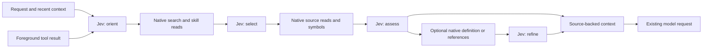

# Ahead of Model Work with Jev

This proof of concept uses Jev throughout a speculative preparation pipeline. While the main agent works, Jev chooses what to inspect, ranks files, compares actual skill instructions, selects semantic lookups, and assesses the resulting evidence. Volt offers the prepared excerpts at an existing model-request boundary. New foreground tool results can trigger another preparation cycle.

The aim is to move discovery and context selection ahead of the main model's next request. Whether this reduces reasoning, tool calls, or completion time remains unmeasured. This is an opt-in example using existing managed services; it adds no dependencies or core protocol changes.

## Run in Volt

From the repository root:

```bash
./volt-test.sh -ne -e ./packages/coding-agent/examples/extensions/jev-ahead-of-model/index.ts --tools read,find,grep,lsp,bash,edit,write --preparation-wait-ms 1000
```

Use `/ahead on`, accept the content-export confirmation, then submit a repository task. `/ahead report` shows decisions, scores, native operations, publications, evaluation latency, and host admission observations. `/ahead status` shows the active allowance; `/ahead off` disables preparation after the current foreground request settles. Abort an active request first to stop promptly.

For explicit noninteractive consent, add `--jev-ahead-of-model`. Loading the extension alone does not enable it. `-ne` disables other discovered extensions while retaining the explicit `-e` example; in particular, do not run both Jev examples together. This command does not change workspace settings.

The tool allowlist enables `find` and `grep`, which are needed for broad repository discovery and are absent from Volt's default active tool set. Adjust the allowlist for your workflow. The extension does not activate tools itself; with only `read`, it can inspect skills and explicit paths but cannot discover other files.

The TUI choice is runtime-only and resets on reload, tree navigation, or session replacement. The CLI flag and SDK `enabled: true` are explicit initial enablement for those runtimes. SDK `enabled: false` prevents command enablement. Nothing is persisted in session history.

## What Jev controls



| Stage | Batched Jev questions | Resulting work |
| --- | --- | --- |
| Orient | Choice: task phase, search term, skill. Boolean: repository investigation useful? | Abstain for conversation; otherwise select up to two literal search terms and shortlist up to three loaded skills. |
| Select | Score and exclusion Boolean per candidate file. Choice and applicability Boolean for shortlisted skills. | Inspect up to three ranked files and retain at most one skill after comparing actual instructions. Request symbols from the highest-ranked file when available. |
| Assess | Usefulness Score and exclusion Boolean per excerpt. Choice over observed symbols and available semantic operations. | Retain useful evidence; optionally follow one definition or references lookup. |
| Refine | Reassess all excerpts after up to two related source reads. | Publish at most six ranked excerpts with native evidence IDs. |

Questions in a stage share one state and one HTTP request. A later stage waits for the actual discovery/read result it evaluates. All three evaluation primitives are used; the entire answer batch must be valid before any decision is applied.

Search terms come from bounded request, recent conversation, and tool text. Files come from managed discovery and explicitly mentioned paths. Navigation choices come from observed native symbols. Jev selects finite candidates; it cannot generate commands, paths, arguments, or code. The ordinary main agent retains implementation and verification work.

Each file/excerpt gets its own usefulness score; the threshold is `1.5` on a four-level `0..3` scale. Boolean decisions use `0.6`. Choice distributions order the search/skill shortlist. These are experimental decision rules, not calibrated confidence or proof of relevance. Full skill descriptions are offered initially; truncated catalogs skip skill selection, and oversized requests abort evaluation rather than silently shortening descriptions.

## Timing and resource bounds

- At most three preparation cycles per committed request: initial preparation plus tool-driven updates. One cycle runs at a time; intermediate tool results coalesce, retaining the latest four results. Retries do not create their own cycles.
- At most four evaluations per cycle, twelve per request. Each HTTP evaluation has a two-second timeout; each managed task has an eight-second deadline. No HTTP retries or alternate endpoint.
- The initial task requests at most 1,000 ms of the host's shared first-request allowance. The host can grant less or zero. Later boundaries add no preparation wait. Several sequential Jev calls can miss the initial allowance; completed evidence can still serve a later authorized continuation.
- No timer starts a model turn. Foreground completion, cancellation, or scope revocation stops outstanding work. Replacement publications wait while the host may be collecting a prior packet. Native freshness checks can omit stale evidence at admission.
- Each cycle requests at most 13 native discovery/read operations: one path scan, two searches, three skill reads, three source reads, one symbols query, one navigation lookup, and two related reads. Host task/scope limits and validation work remain independent and can stop preparation sooner.
- Discovery is deliberately partial: at most 160 scanned paths, 24 hits per selected term, and 24 candidate files for scoring. Read windows are 80 lines per skill, 60 per selected file, and 40 per related source. Excerpts sent for assessment are at most 2,400 bytes; each published source excerpt is at most 900 bytes.
- Request and response JSON are each capped at 64 KiB, with at most 64 questions per call. Managed host contribution limits apply as well. These bounds do not enforce a dollar budget, and aborting a client does not guarantee zero provider billing.

The extension does not cache across requests or transparently fulfill later `read` tool calls. Each new cycle obtains fresh evidence. It prepares evidence, not completed skill workflows or verified outcomes. Source paths with hidden components, dependency/build directories, unusual characters, or unsupported extensions are excluded from its candidate pool; this is not a secret detector or complete repository index.

## Export consent and access

**Enabling this example authorizes broader export than `jev-context-preparation.ts`.** It sends bounded request text, recent user/assistant/tool-result text, recent foreground tool output, relative candidate paths, grep snippets, full loaded skill descriptions, and selected skill/source excerpts to **Vercel AI Gateway / TypeSafe AI**. Content is not automatically redacted and may contain private data or secrets. The older `/jev` choice does not enable this example.

The request snapshot is capped at 8,192 bytes, recent conversation at eight text messages / 8,192 bytes from the latest sixteen branch entries, and tool observations at four / 2,048 bytes each. Context before a compaction boundary is skipped. Thinking blocks, system messages, custom session entries, image bytes, host resource IDs, and the absolute cwd are not automatically added. Those values could still appear in user-authored text or source content. Missing or truncated context can cause incorrect decisions.

Credentials resolve through the session's `modelRegistry.getApiKeyForProvider("vercel-ai-gateway")`. Existing Volt `/login`, supported environment credentials, and provider key configuration apply. The public endpoint is fixed to `https://ai-gateway.vercel.sh/v1/evaluate`; redirects are refused. **Zero Data Retention is off by default.** SDK `zeroDataRetention: true` requires Gateway ZDR support and never retries with it disabled.

All repository access uses managed native services and their active tool authority, policy hooks, result reducers, cancellation, and source validation. A denial of `read` does not automatically deny `grep`: both can disclose source content, so policies protecting source must cover both. Native access permission and external-export consent are separate. Missing credentials, invalid answers, unavailable services, or denied reads omit optional preparation; the main request continues.

`/ahead report` is an in-memory diagnostic view containing relative candidate paths, scores, probabilities, operation outcomes, and validated usage/cost metadata. It does not include prompt/source bodies, keys, or raw provider errors. Host admission observations are not final-payload delivery receipts and do not establish that the model used the evidence. Reports retain the latest scope and up to eight request-boundary observations. No report command triggers inference or additional reads.

## SDK integration

```typescript
import { createAgentSession, DefaultResourceLoader, getAgentDir, SessionManager } from "@hansjm10/volt-coding-agent";
import { createJevAheadOfModel } from "./examples/extensions/jev-ahead-of-model/index.ts";

const cwd = process.cwd();
const resourceLoader = new DefaultResourceLoader({
  cwd,
  agentDir: getAgentDir(),
  extensionFactories: [createJevAheadOfModel({
    enabled: true, // Explicit consent to the content export described above.
    zeroDataRetention: false,
    onReport: (report) => console.log(report),
  })],
});
await resourceLoader.reload();
const { session } = await createAgentSession({
  cwd,
  resourceLoader,
  tools: ["read", "find", "grep", "lsp"],
  sessionManager: SessionManager.inMemory(cwd),
  extensionWorkLimits: { firstRequestWaitMs: 1000 },
});
try {
  await session.bindExtensions({});
  await session.prompt("Investigate why session resume restores the wrong branch.");
} finally {
  session.dispose();
  await session.waitForClosed();
}
```

Adapt the example import to your script location. Semantic navigation is optional and requires an available native LSP service. `fetch` is a trusted transport override for offline fixtures and must honor cancellation. Diagnostic callbacks must remain fast; callback failures are contained.

## Reproducible demonstration and tests

The SDK demonstration creates an isolated synthetic workspace and skill. The main provider is scripted: four requests with three fixed 2.5-second work periods and ordinary read-tool checkpoints. These fixed delays allow observation of background preparation; the extension never introduces them. Live mode calls the real Jev endpoint, exports only the synthetic fixture, and prints decisions, per-call timing/usage, and which main-request projections contained prepared source. It cleans up its temporary workspace and uses an in-memory session.

```bash
# Repository root. Uses the same Jiti path mapping as Volt's source launcher.
JITI_TSCONFIG_PATHS=./tsconfig.json node node_modules/jiti/lib/jiti-cli.mjs packages/coding-agent/examples/sdk/14-jev-ahead-of-model.ts --disabled
JITI_TSCONFIG_PATHS=./tsconfig.json node node_modules/jiti/lib/jiti-cli.mjs packages/coding-agent/examples/sdk/14-jev-ahead-of-model.ts --live

# Offline contract and native lifecycle tests; no real provider calls.
cd packages/coding-agent
node node_modules/vitest/dist/cli.js --run test/jev-ahead-of-model.test.ts test/suite/jev-ahead-of-model.test.ts
```

`--live` is explicit consent to up to twelve paid Jev evaluations of synthetic data. It fails clearly when Gateway credentials are unavailable, and exits unsuccessfully if no evaluation succeeds or no source reaches a main-request projection. It is not a quality benchmark: the main responses are fixed, and their timing must not be presented as reasoning savings. The offline tests exercise four-stage selection and navigation, native source/skill admission, tool-driven refresh, consent, access controls, cancellation, finite answers, and bounded transport.

Validation on 2026-09-21: 34 targeted tests and the full repository check passed. The standalone SDK demo also completed with a substituted offline transport imposing 500 ms per evaluation: three cycles / nine evaluations, no initial prepared packet, then source evidence in all three later projections. Both enabled and disabled runs made exactly four scripted main requests. The real Gateway run stopped before network access because credentials were unavailable, so live decision quality and latency remain unverified.

The implementation follows the [Gateway evaluation contract](https://vercel.com/docs/ai-gateway/modalities/evaluation). The shortlist-then-inspect approach is informed by [TypeSafe's skill-suggestion cookbook](https://docs.typesafe.ai/cookbooks/skill_suggestion). A real-task comparison should hold the main model, request corpus, and tools fixed and measure task correctness, foreground calls, elapsed time, added context, auxiliary cost, and regressions from irrelevant evidence before making this a default.
