# Ahead of Model Work with Jev

This proof of concept uses Jev throughout a speculative preparation pipeline. While the main agent works, Jev chooses what to inspect, ranks files, compares actual skill instructions, selects code regions and semantic lookups, and assesses the exact excerpts that will be published. Volt offers the prepared excerpts at an existing model-request boundary. New foreground tool results are grouped into an update at the next boundary.

The aim is to move discovery and context selection ahead of the main model's next request. Whether this reduces reasoning, tool calls, or completion time remains unmeasured. This is an opt-in example using existing managed services; it adds no dependencies or core protocol changes.

## Run in Volt

From the repository root:

```bash
./volt-test.sh -ne -e ./packages/coding-agent/examples/extensions/jev-ahead-of-model/index.ts --tools read,find,grep,lsp,bash,edit,write --preparation-wait-ms 1000
```

Use `/ahead on`, accept the content-export confirmation, then submit a repository task. `/ahead report` shows decisions, scores, native operations, publications, evaluation latency, and host admission observations. `/ahead status` shows the active allowance; `/ahead off` disables preparation after the current foreground request settles. Abort an active request first to stop promptly.

For explicit noninteractive consent, add `--jev-ahead-of-model`. Loading the extension alone does not enable it. `-ne` disables other discovered extensions while retaining the explicit `-e` example; in particular, do not run both Jev examples together. This command does not change workspace settings.

The tool allowlist enables `find` and `grep`, which are needed for broad repository discovery and are absent from Volt's default active tool set. Adjust the allowlist for your workflow. The extension does not activate tools itself; with only `read`, it can inspect skills and explicit paths but cannot discover other files.

The TUI choice is runtime-only and resets on reload, tree navigation, or session replacement. The CLI flag and SDK `enabled: true` are explicit initial enablement for those runtimes. SDK `enabled: false` prevents command enablement. Audit data persists with the session; saved audits never restore consent.

## What Jev controls

```mermaid
flowchart LR
    Request[Request and recent context] --> Orient[Jev: orient]
    Orient --> Discover[Native search and skill reads]
    Discover --> Select[Jev: select]
    Select --> Symbols[Native symbols]
    Symbols --> Focus[Jev: choose code regions]
    Focus --> Read[Native source reads]
    Read --> Assess[Jev: assess]
    Assess --> Navigate[Optional native definition or references]
    Navigate --> Refine[Jev: refine]
    Assess --> Packet[Source-backed context]
    Refine --> Packet
    Packet --> Boundary[Existing model request]
    Tools[Foreground tool result] --> Orient
```



| Stage | Batched Jev questions | Resulting work |
| --- | --- | --- |
| Orient | Choice: task phase, search term, skill. Boolean: repository investigation useful? | Abstain for conversation; otherwise select up to two literal search terms and shortlist up to three loaded skills. |
| Select | Score and exclusion Boolean per candidate file. Choice and applicability Boolean for shortlisted skills. | Select up to three ranked files and retain at most one skill after comparing actual instructions. Request symbols from each selected file when available. |
| Focus | Choice over observed source locations and symbol ranges for each file. | Read the implementation or test region Jev selects instead of automatically taking the file prefix. Fully read regions are excluded. Skip this stage when there is no region choice. |
| Assess | Usefulness Score and exclusion Boolean per excerpt. Choice over observed symbols and available semantic operations. | Retain useful evidence; optionally follow one definition or references lookup. |
| Refine | Reassess all excerpts after up to two related source reads. | Publish ranked excerpts unchanged from assessment, with native evidence IDs, within the packet budget. |

Questions in a stage share one state and one HTTP request, with one bounded transient-failure retry available per cycle. A later stage waits for the actual discovery/read result it evaluates. All three evaluation primitives are used; the entire answer batch must be valid before any decision is applied.

Search terms come from bounded request, recent conversation, and tool text, prioritizing observed file names. Explicit paths, cited lines, foreground tool paths and changed-file lists take precedence over generic discovery. Git output is observed from foreground tools; this extension does not execute Git. Known paths avoid broad scans; otherwise a selected term narrows path discovery. Secondary search terms require at least 0.15 probability. Navigation choices come from observed native symbols. Jev selects finite candidates; it cannot generate commands, paths, arguments, or code. The ordinary main agent retains implementation and verification work.

Path observations retain their origin. Relative imports and Markdown links resolve against their containing source file; arbitrary source strings and fenced documentation examples do not become paths. Foreground find/grep output resolves against its search directory. Before scoring mentions, native file discovery checks up to three containing directories and retains exact matches. Broad discovery also inspects one matching directory, so an implementation named `index.ts` can accompany matching test files. Unchecked or missing mentions are omitted; when path discovery is not available as a service, only explicit user paths and observed foreground paths are eligible.

Diff hunk locations guide reads past the file prefix. Single-line symbol locations expand into windows of up to 120 lines. Region choices favor named declarations and methods, excluding variable aliases and anonymous callbacks. Up to two file-scoped native searches locate declarations and test bodies when JavaScript or TypeScript symbols are missing, partial, or describe a test file. These are bounded text matches, not complete syntax analysis. When declarations are available, a generic line-one choice is omitted; observed locations past line one remain eligible. A single remaining region requires no Jev focus call. A semantic lookup that adds no evidence does not trigger another assessment.

Each file/excerpt gets its own usefulness score; the threshold is `1.5` on a four-level `0..3` scale. Boolean decisions use `0.6`. Choice distributions order the search/skill shortlist. These are experimental decision rules, not calibrated confidence or proof of relevance. Full skill descriptions are offered initially; truncated catalogs skip skill selection, and oversized requests abort evaluation rather than silently shortening descriptions.

## Timing and resource bounds

- At most twelve preparation cycles per committed request: initial preparation plus updates at subsequent model-request boundaries. One cycle runs at a time; a burst of tool results produces one pending update. Identical recent tool observations are skipped. The latest four distinct outputs are retained, together with up to 64 observed paths and 64 foreground read ranges. Retries do not create their own cycles.
- At most five evaluation stages plus one retry per cycle, with a hard ceiling of sixty attempts per request including retries. HTTP 502, 503 and 504 responses can retry the same stage once after 500 ms, preserving the exact input and retention option. Other failures are not retried. Each HTTP attempt has a two-second timeout; the retry shares the managed task's twelve-second deadline and is cancelled when the task stops. No alternate endpoint.
- The initial task requests at most 1,000 ms of the host's shared first-request allowance. The host can grant less or zero. Later boundaries add no preparation wait. Several sequential Jev calls can miss the initial allowance; completed evidence can still serve a later authorized continuation.
- No timer starts a model turn. Foreground completion, cancellation, or scope revocation stops outstanding work. Replacement publications wait while the host may be collecting a prior packet. Native freshness checks can omit stale evidence at admission.
- Each cycle requests at most 16 native discovery/read operations. Known paths use up to three directory checks; otherwise discovery uses one path scan and optionally inspects one matching directory. Two broad text searches are available only with fewer than three known paths. Remaining operations can include three skill reads, three symbols queries, two declaration searches, three source reads, one navigation lookup, and two related reads. Declaration searches and navigation are skipped when insufficient capacity remains.
- Preparation uses a request-level allowance of 48 operations, reduced by preparation attempts and one validation reservation per offered excerpt at each observed boundary. Reservations are conservative estimates, not measured validation counts. This leaves 16 operations below the default host ceiling of 64 for later source validation. A new cycle requires at least eight remaining operations; native limit failures stop subsequent Jev evaluations. Host limits remain authoritative and can stop preparation sooner. Long continuations can still exhaust validation capacity after preparation stops.
- Discovery is deliberately partial: at most 160 paths per directory check or scan, 24 text matches per search, and 24 candidate files for scoring. Read windows are 80 lines per skill and at most 120 lines per source region. Each selected file offers at most 24 distinct unread regions, assembled from its observed location, up to sixteen declaration symbols, and declaration/test text matches.
- Each assessed excerpt is at most 3,000 bytes, ending at a complete line. The published excerpt is identical. The packet contains at most six excerpts and 8,000 bytes including labels; a lower-ranked excerpt that does not fit is omitted rather than shortened after assessment.
- Request and response JSON are each capped at 64 KiB, with at most 64 questions per call. Managed host contribution limits apply as well. These bounds do not enforce a dollar budget, and aborting a client does not guarantee zero provider billing.

Successful foreground `read` calls retire covered prepared excerpts and exclude covered regions from later preparation. For truncated reads, only complete source lines confirmed by the native truncation metadata and returned text count as read. Missing, changed, or partial-line metadata is ignored. A read that overtakes an in-flight evaluation also prevents its late publication. Known `edit` and `write` calls invalidate remembered read ranges for that path. Opaque shell reads and external edits are not fully tracked.

Successful path searches, text searches, symbol queries, and skill reads are cached within one request, bounded to 64 entries and 256 KiB. Source reads remain fresh. Cache hits avoid native preparation operations but never bypass source validation at admission. Failed operations are not cached. Mutating or unknown foreground tools clear the cache at both start and completion; a changed service/skill catalog also clears it. Results captured before an invalidation cannot repopulate the cache afterward. External edits can still leave discovery observations stale until invalidation; native validation can omit stale published evidence. The cache does not span requests or fulfill foreground `read` calls.

The extension prepares evidence, not completed skill workflows or verified outcomes. Source paths with hidden components, dependency/build directories, unusual characters, or unsupported extensions are excluded from its candidate pool; this is not a secret detector or complete repository index.

## Export consent and access

**Enabling this example authorizes broader export than `jev-context-preparation.ts`.** It sends bounded request text, recent user/assistant/tool-result text, recent foreground tool output, relative candidate paths, grep snippets, full loaded skill descriptions, and selected skill/source excerpts to **Vercel AI Gateway / TypeSafe AI**. Content is not automatically redacted and may contain private data or secrets. The older `/jev` choice does not enable this example.

The request snapshot is capped at 8,192 bytes, recent conversation at eight text messages / 8,192 bytes from the latest sixteen branch entries, and tool observations at four / 2,048 bytes each. Duplicate tool text is omitted from the recent-conversation window. Up to 64 relative paths can also be extracted from the first 8,192 bytes of each foreground result and observed tool arguments. Up to 64 read ranges describe evidence already available to the foreground. Context before a compaction boundary is skipped. Thinking blocks, system messages, custom session entries, image bytes, host resource IDs, and the absolute cwd are not automatically added. Those values could still appear in user-authored text or source content. Missing or truncated context can cause incorrect decisions.

Credentials resolve through the session's `modelRegistry.getApiKeyForProvider("vercel-ai-gateway")`. Existing Volt `/login`, supported environment credentials, and provider key configuration apply. The public endpoint is fixed to `https://ai-gateway.vercel.sh/v1/evaluate`; redirects are refused. **Zero Data Retention is off by default.** SDK `zeroDataRetention: true` requires Gateway ZDR support and never retries with it disabled.

The default credential file is `~/.volt/agent/auth.json`, with the key stored under `vercel-ai-gateway`. `VOLT_CODING_AGENT_DIR` changes the agent directory; `AI_GATEWAY_API_KEY` is also supported. The demo reads the existing credential and passes it through an in-memory override without copying it into its temporary workspace or report.

All repository access uses managed native services and their active tool authority, policy hooks, result reducers, cancellation, and source validation. A denial of `read` does not automatically deny `grep`: both can disclose source content, so policies protecting source must cover both. Native access permission and external-export consent are separate. Missing credentials, invalid answers, unavailable services, or denied reads omit optional preparation; the main request continues.

`/ahead report` is an in-memory diagnostic view containing relative candidate paths, scores, probabilities, operation outcomes and reasons, cache hits, preparation attempts, validation reservations, remaining preparation allowance, skipped duplicate counts, retired excerpts, and validated usage/cost metadata. The report does not include prompt/source bodies, keys, or raw provider errors. The persistent audit includes these diagnostics alongside the content described below. Host admission observations are not final-payload delivery receipts and do not establish that the model used the evidence. Reports retain the latest scope and up to 64 timestamped request-boundary observations. No report command triggers inference or additional reads.

## Persistent audit history

After a request ends, use `/ahead history` to list the latest ten audited requests across the current session's branches. Use `/ahead audit` for the latest full audit, or `/ahead audit <entry-id>` for a specific one. These commands work after reopening the session with this extension loaded, even while Jev is disabled, and make no model or repository calls. History identifies in-memory SDK sessions as non-durable.

Each `jev-ahead-audit` custom session entry records:

- Session, request scope, runtime and branch identifiers, start/seal timestamps, and whether work was interrupted.
- Each cycle/stage's exact bounded request JSON in `evaluations[].requestBody`, including the supplied state, questions and retention option. The stage attempt number and start, dispatch and finish timestamps distinguish retries and local attempts from HTTP calls. Oversized inputs are rejected before capture; their bodies are omitted and the size failure is recorded.
- Validated answers, complete probability distributions, input/output token counts, reported cost, HTTP status, elapsed time and request bytes. Missing provider metrics stay unknown. Credentials, HTTP headers and raw provider error bodies are excluded.
- File and region selections, native operation outcomes, selected contribution text and evidence IDs, publication timestamps/results, foreground-read omissions and retirements, and timestamped host admission observations keyed by model-request attempt and publication cycle. A missing publication result without an omission reason means publication was not observed before sealing. These observations do not prove final payload delivery or model use.

Audits contain the actual exported conversation, tool text, source and skill content, which can include sensitive material. They use the existing session retention and export behavior; deleting or exporting a session affects its audit data too. They are custom entries, not model messages, and are excluded from both the main model's context and later Jev conversation snapshots. `onReport` remains a metadata-only callback.

One detached audit is appended when the foreground run ends, or at a safe shutdown/supersession boundary. Writing custom entries during preparation would move the canonical session cursor and invalidate prepared context. Pending calls are therefore buffered until sealing; an abrupt process crash before sealing or SQLite persistence can lose that request's audit. Work still running at sealing is marked `interrupted`, missing results remain unobserved, and late callbacks cannot mutate the saved record or write into another branch. Audit append failures warn without blocking the main response. Normal session close drains SQLite persistence.

The records are in the existing `entries` table's `payload_json`, with `entry_type = 'custom'` and `customType = 'jev-ahead-audit'`. `/ahead history` shows the entry IDs. To inspect the database directly, locate the session's `sessions.sqlite` under `~/.volt/agent/sessions/` (or the configured agent directory) and run this read-only query:

```sql
SELECT session_id, entry_id, timestamp,
       json_extract(payload_json, '$.data.requestId') AS request_id,
       json_array_length(json_extract(payload_json, '$.data.evaluations')) AS evaluations,
       json_extract(payload_json, '$.data.interrupted') AS interrupted,
       json_extract(payload_json, '$.data') AS audit
FROM entries
WHERE entry_type = 'custom'
  AND json_extract(payload_json, '$.customType') = 'jev-ahead-audit'
ORDER BY timestamp DESC
LIMIT 10;
```

The older `/jev` extension's `jev-context-call` entries remain metadata-only; this full audit applies to the `/ahead` pipeline.

## SDK integration

```typescript
import { createAgentSession, DefaultResourceLoader, getAgentDir, SessionManager } from "@hansjm10/volt-coding-agent";
import { createJevAheadOfModel } from "./examples/extensions/jev-ahead-of-model/index.ts";

const cwd = process.cwd();
const resourceLoader = new DefaultResourceLoader({
  cwd,
  agentDir: getAgentDir(),
  extensionFactories: [createJevAheadOfModel({
    enabled: true, // Explicit consent to the content export described above.
    zeroDataRetention: false,
    onReport: (report) => console.log(report),
  })],
});
await resourceLoader.reload();
const { session } = await createAgentSession({
  cwd,
  resourceLoader,
  tools: ["read", "find", "grep", "lsp"],
  sessionManager: await SessionManager.create(cwd), // SQLite-backed audit history.
  extensionWorkLimits: { firstRequestWaitMs: 1000 },
});
try {
  await session.bindExtensions({});
  await session.prompt("Investigate why session resume restores the wrong branch.");
} finally {
  session.dispose();
  await session.waitForClosed();
}
```

Adapt the example import to your script location. Use `SessionManager.inMemory(cwd)` for a temporary session whose audits disappear on exit. Semantic navigation is optional and requires an available native LSP service. `fetch` is a trusted transport override for offline fixtures and must honor cancellation. Diagnostic callbacks must remain fast; callback failures are contained.

## Reproducible demonstration and tests

The SDK demonstration creates an isolated synthetic workspace and skill. The main provider is scripted: four requests with three fixed 2.5-second work periods and ordinary read-tool checkpoints. These fixed delays allow observation of background preparation; the extension never introduces them. Live mode calls the real Jev endpoint, exports only the synthetic fixture, and prints decisions, per-call timing/usage, and which main-request projections contained prepared source. It also closes and reopens its SQLite session to verify the audit round trip, then deletes the temporary workspace and database.

```bash
# Repository root. Uses the same Jiti path mapping as Volt's source launcher.
JITI_TSCONFIG_PATHS=./tsconfig.json node node_modules/jiti/lib/jiti-cli.mjs packages/coding-agent/examples/sdk/14-jev-ahead-of-model.ts --disabled
JITI_TSCONFIG_PATHS=./tsconfig.json node node_modules/jiti/lib/jiti-cli.mjs packages/coding-agent/examples/sdk/14-jev-ahead-of-model.ts --live

# Offline contract and native lifecycle tests; no real provider calls.
cd packages/coding-agent
node node_modules/vitest/dist/cli.js --run test/jev-ahead-of-model.test.ts test/suite/jev-ahead-of-model.test.ts
```

`--live` is explicit consent to up to sixty paid Jev evaluations of synthetic data. It fails clearly when Gateway credentials are unavailable, and exits unsuccessfully if no evaluation succeeds, no source reaches a main-request projection, or its audit fails the SQLite round trip. It is not a quality benchmark: the main responses are fixed, and their timing must not be presented as reasoning savings. The offline tests also cover changed-file discovery, code-region selection, exact assessed/published excerpts, tool-batch coalescing, duplicate suppression, continued preparation beyond three cycles, foreground-read retirement, late-publication suppression, and the existing persistence/lifecycle contracts.

Validation on 2026-09-22: 75 focused tests and the full repository check passed. New offline regressions cover request-local cache reuse and invalidation, omission of cached skill evidence after external edits, native budget stops, implementation discovery inside matching directories, declaration/test selection from import-heavy symbol lists, and retirement after truncated foreground reads. A 13-request faux-provider conversation retained admitted evidence through its final boundary without exceeding the default native budget, and stopped new Jev calls after preparation capacity ran low. These results establish bounded behavior in fixtures; performance improvements on real tasks remain unmeasured.

Validation of the expanded implementation on 2026-09-21: 49 focused tests and the full repository check passed. The live synthetic demo completed six HTTP 200 evaluations across two cycles, with a 223 ms median evaluation time, 6,582 reported input tokens and 848 output tokens. Prepared source reached the first main request at 967 ms and remained available in all four projections; later boundaries added no wait. The checkpoint excerpt disappeared after the foreground read it. Repeated identical checkpoint results did not start further cycles. The SQLite audit round trip passed, as did the disabled baseline. Both runs made four scripted main requests. This fixture has no LSP service; symbol-region selection is covered by offline tests, not this live run.

The results below describe the earlier three-cycle implementation.

Validation on 2026-09-21: 34 targeted tests and the full repository check passed. The standalone SDK demo also completed with a substituted offline transport imposing 500 ms per evaluation: three cycles / nine evaluations, no initial prepared packet, then source evidence in all three later projections. Both enabled and disabled runs made exactly four scripted main requests.

Audit validation on 2026-09-21: 40 targeted tests cover persistence and retrieval alongside the existing preparation contracts. The updated live demo completed nine HTTP 200 evaluations and recovered its audit unchanged after closing and reopening SQLite; the disabled demo recovered zero audits. Both made four scripted main requests.

A subsequent live run using the existing Volt Gateway credential completed all nine evaluations successfully: **54 typed questions**, 11,032 reported input tokens, and 1,536 reported output tokens. Individual HTTP evaluation times ranged from **185 to 829 ms**, with a **255 ms median**. Gateway reported cost `0` for each call; this is observed metadata, not a promise of free future usage.

| Cycle | Summed evaluation time, excluding native operations | Published evidence |
| --- | --- | --- |
| Initial | 1,425 ms | Session source, session-debugging skill, checkpoint observation |
| First tool update | 637 ms | Same three relevant excerpts, freshly assessed |
| Second tool update | 757 ms | Same three relevant excerpts, freshly assessed |

Jev ranked `src/session.ts` at 2.83–2.89 and the unrelated `src/colors.ts` at 0.01; it omitted the latter in every cycle. The first packet missed the 1,000 ms initial allowance, and all three later main-request projections contained the prepared source and three excerpts with no renewed preparation wait. The main provider made exactly four scripted requests. This fixture has no LSP service, so live semantic navigation was not exercised. These results validate the live evaluation contract and synthetic selection/admission behavior; real main-model correctness, reasoning savings, and performance distributions remain unmeasured.

The implementation follows the [Gateway evaluation contract](https://vercel.com/docs/ai-gateway/modalities/evaluation). The shortlist-then-inspect approach is informed by [TypeSafe's skill-suggestion cookbook](https://docs.typesafe.ai/cookbooks/skill_suggestion). A real-task comparison should hold the main model, request corpus, and tools fixed and measure task correctness, foreground calls, elapsed time, added context, auxiliary cost, and regressions from irrelevant evidence before making this a default.
